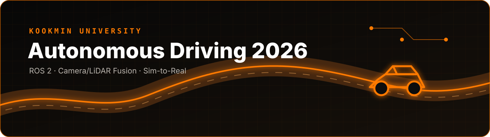
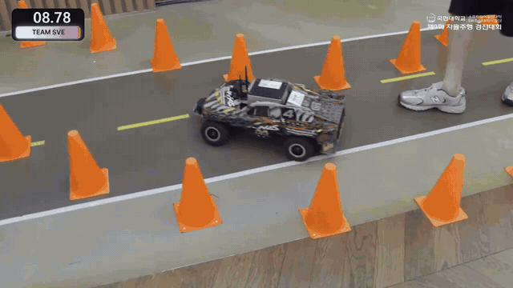
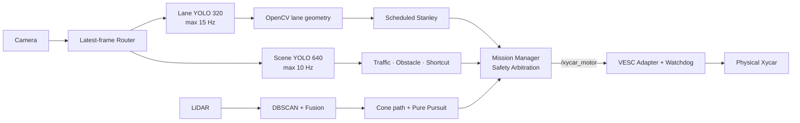
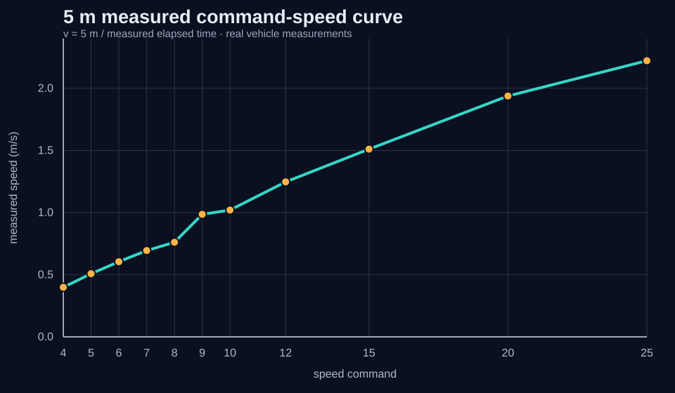
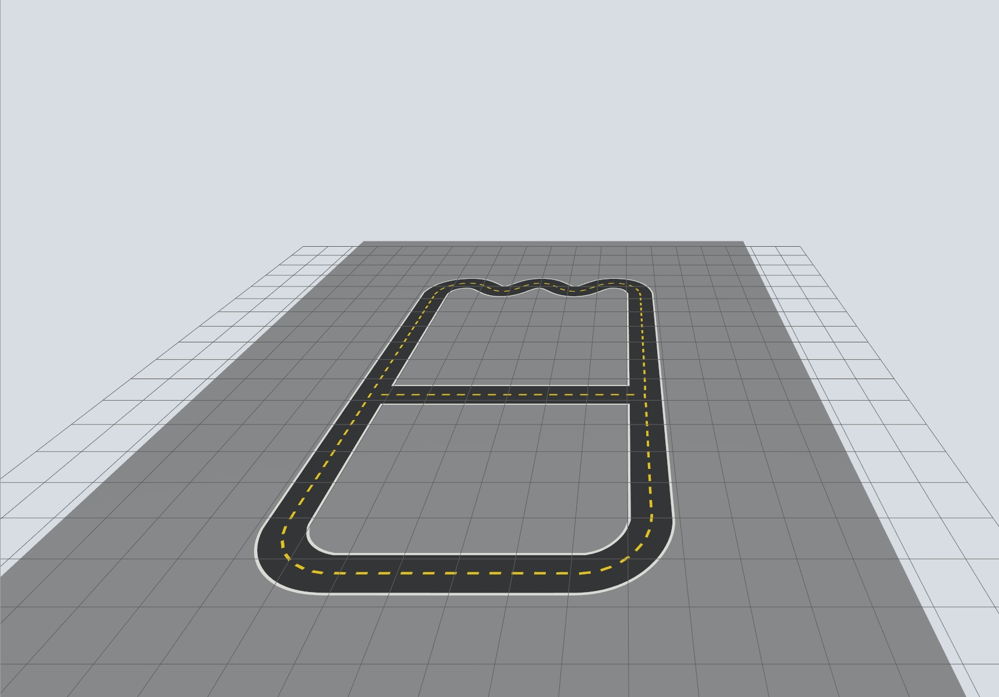
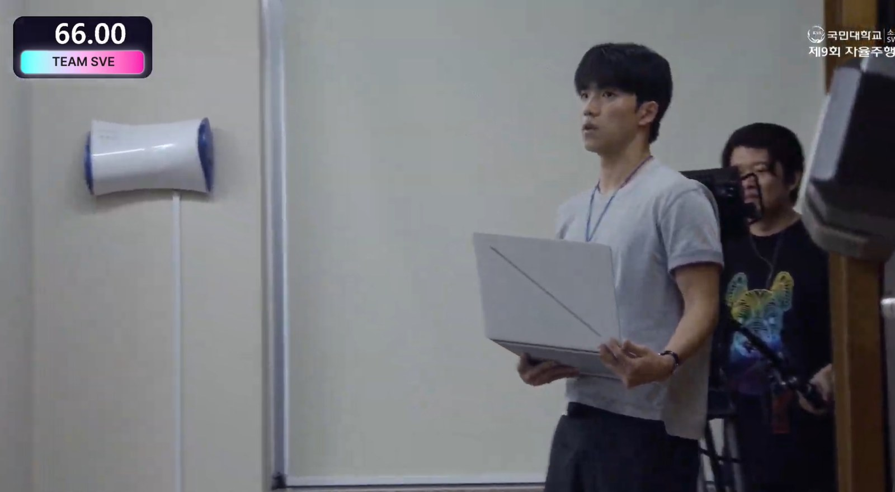
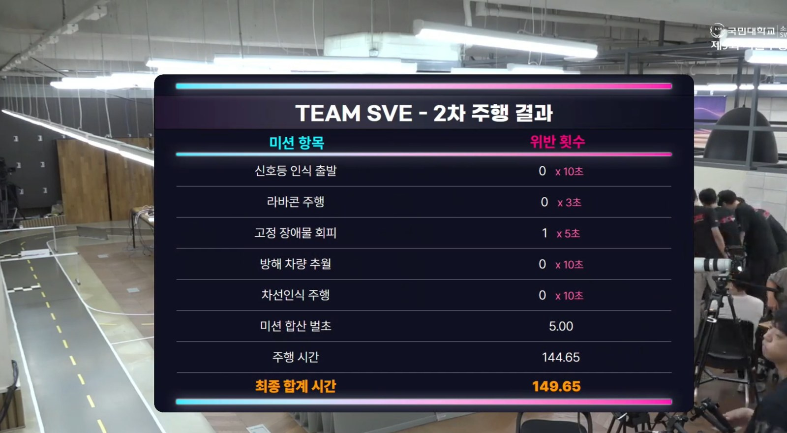

<p align="center">
  
</p>

# Kookmin 2026 Autonomous Driving

국민대학교 제9회 자율주행 경진대회를 위해 개발한 Xycar 기반 ROS 2 자율주행 시스템이다. Camera/LiDAR perception, mission arbitration, Stanley/Pure Pursuit control, VESC safety boundary와 실측 기반 Gazebo 환경을 하나의 stack으로 통합했다.

## Competition Run / 실제 대회 주행

<p align="center">
  
</p>

<p align="center">
  <strong><a href="media/video/competition_drive_2x.mp4">▶ 본선 연속 주행 2배속 MP4 재생</a></strong><br>
  원본 4:56:45–4:57:11의 정지 없는 주행 구간을 13 s로 편집 · 720p H.264 · 무음
</p>

저장소에 본선 주행 영상을 직접 포함했다. 전체 방송 맥락은 [공식 영상의 Team SVE 구간](https://youtu.be/CcfXS3UFL0A?t=17782)에서 확인할 수 있으며, 별도의 팀 촬영 자료인 [콘 구간 실차 16 s](media/video/cone_course_run.mp4)도 함께 보존했다.

## Project Overview

| 항목 | 내용 |
|---|---|
| Competition | 제9회 국민대학교 자율주행 경진대회, Team SVE |
| Vehicle | 1/10-scale Xycar, fisheye camera, 2D LiDAR, VESC |
| Runtime | Ubuntu 22.04, ROS 2 Humble, Fast DDS |
| Goal | lane, traffic light, dynamic/static obstacle, shortcut left-turn, cone mission의 end-to-end 통합 |
| Project type | 팀 프로젝트; 아래 contribution은 사용자가 직접 담당·주도한 영역을 코드와 연결해 기록 |

## My Contribution

| 담당 영역 | 수행 내용 | 관련 코드 |
|---|---|---|
| Camera Perception | Lane/Scene YOLO 분리, confidence·input size·실행 주기 tuning | [`yolo_node.py`](ros2_ws/src/cam/cam/yolo_node.py), [`frame_router.py`](ros2_ws/src/cam/cam/frame_router.py) |
| Lane Geometry & Control | YOLO+OpenCV lane geometry, Stanley 설계, gain/speed tuning | [`Lane_Detector.py`](ros2_ws/src/cam/cam/Lane_Detector.py), [`Integrated_Stanley_Controller.py`](ros2_ws/src/cam/cam/Integrated_Stanley_Controller.py) |
| Mission Integration | `STOP/PAUSED/LANE/OVERTAKE/CONE` arbitration, freshness와 VESC fail-safe 통합 | [`mission_manager_node.py`](ros2_ws/src/mission_cone_drive/mission_cone_drive/mission_manager_node.py) |
| Obstacle Perception | dynamic/static YOLO와 LiDAR association, 목표 차선·speed/event parameter tuning | [`target_lane_planner.py`](ros2_ws/src/cam/cam/target_lane_planner.py), [`obstacle_lidar_fusion.py`](ros2_ws/src/cam/cam/obstacle_lidar_fusion.py) |
| Shortcut Left Turn | left signal 인식과 진입/회전/이탈 FSM 통합 | [`traffic_light_node.py`](ros2_ws/src/cam/cam/traffic_light_node.py), [`shortcut_left_turn_logic.py`](ros2_ws/src/cam/cam/shortcut_left_turn_logic.py) |
| Sim-to-Real | 차량 치수·조향·속도 실측, 좌우 LUT와 Gazebo interface calibration | [`simulation/xycar_gz_sim/`](simulation/xycar_gz_sim/), [실차 calibration](docs/REAL_VEHICLE_CALIBRATION.md) |

팀 전체 구현을 혼자 했다는 의미가 아니라, 위 영역을 담당·주도하고 통합·튜닝했다는 범위다. 공개 Git history는 개발 중간 이력을 한 commit으로 가져온 형태라 파일별 개인 기여를 commit 통계로 분리할 수 없어 사용자 제공 역할 정보를 기준으로 작성했다.

## Validation & Results

검증 가능한 A-D class 수치만 사용했다. 원시 입력과 계산식은 링크된 문서/CSV에 있다.

| Result | Value | Evidence |
|---|---:|---|
| Final perception configuration | Lane 320 px / 최대 15 Hz, Scene 640 px / 최대 10 Hz | [final start script](scripts/start_integrated_drive_container.sh), [architecture](docs/ARCHITECTURE.md) |
| Unsafe S-curve 10→16 acceleration | Run 02 **7→0**, Run 03 **3→0**; 두 replay 모두 100% 제거 | [manifest](evaluation/validation_manifest.json), [validation](docs/VALIDATION_EVIDENCE.md) |
| Measured 5 m speed | command 4: 0.399 m/s, command 25: 2.222 m/s; **5.57×** | [raw CSV](evaluation/calibration/speed_5m_measurements.csv), [calibration](docs/REAL_VEHICLE_CALIBRATION.md) |
| Steering asymmetry at \|raw\| 40 | right 0.5525 m vs left 0.8200 m; left radius **48.4% larger** | [raw CSV](evaluation/calibration/steering_circle_measurements.csv) |
| Gazebo max-steer radius replay | right 0.9%, left 1.9% absolute error at ±40 | [comparison](evaluation/calibration/sim_real_comparison.csv), [limits](docs/SIM_TO_REAL.md) |
| Competition second run | driving 144.65 s + penalty 5.00 s = **149.65 s** | [result image](media/competition/final-result-149-65s.jpg), [retrospective](docs/COMPETITION_RETROSPECTIVE.md) |

`cte_px` replay는 image-plane lane-center proxy이고 실제 vehicle pose error가 아니다. 최대 조향 sim-real 수치도 calibrated LUT knot 재현 결과이며 전체 trajectory accuracy로 일반화하지 않는다.

## System Architecture



[Detailed Architecture → `docs/ARCHITECTURE.md`](docs/ARCHITECTURE.md)

## Perception

- **Dual YOLO:** center-line 전용 320 px branch와 cone/dynamic/green/left/red/static 640 px branch를 분리했다.
- **Latest-frame routing:** worker가 바쁜 동안 오래된 FIFO를 쌓지 않고 pending frame을 최신 입력으로 교체한다.
- **YOLO + OpenCV hybrid:** YOLO ROI 안에서 adaptive threshold, Canny, Hough와 polynomial fit으로 lane geometry를 만든다.
- **LiDAR:** rotated scan을 DBSCAN으로 묶고 최대 지름 0.30 m 등의 조건으로 cone 후보를 만든다.
- **Camera-LiDAR fusion:** fisheye projection으로 obstacle/cone image box와 LiDAR cluster를 연결한다.

Single→dual pipeline의 동등 조건 FPS log는 저장소에 없어 “N% 빨라졌다”고 쓰지 않았다. 최종 운용값과 code default의 차이는 [Dual YOLO 문서](ros2_ws/src/mission_cone_drive/DUAL_YOLO_PIPELINES.md)에 명시했다.

## Decision & Planning

- Mission Manager는 `STOP`, `PAUSED`, `LANE`, `OVERTAKE`, `CONE` 상태와 `PAUSED > RED/STOP > CONE > LANE/OVERTAKE` 우선순위를 적용한다.
- Traffic light는 red/green/left class와 latch/confirmation을 사용한다. final red threshold는 0.30, code default는 0.20이다.
- Dynamic/static obstacle은 같은 obstacle Stanley k를 공유하지만 speed cap, trigger distance, lane-change distance와 event duration이 다르다.
- Shortcut FSM은 left signal, base lane curve, cross-line/alignment confirmation을 이용해 좌회전 진입과 lane handoff를 관리한다.
- Cone entry는 YOLO box, LiDAR cluster, 양쪽 cone evidence와 path point 수를 확인한 뒤 mode를 전환한다.

## Control

- **Lane:** Stanley의 CTE gain을 command 4–12에서 scheduling한다. straight `1.00→0.65`, curve `1.20→0.90`, obstacle override `1.80`이다.
- **Heading:** low-speed 0.30에서 straight 0.18, Hough 0.14, curve 0.30으로 context-aware weight를 사용한다.
- **Cone:** final launcher는 DBSCAN spline path + Pure Pursuit를 선택한다. cone Stanley/preview 코드는 대안·회귀시험용이다.
- **Speed:** curvature severity와 S-reversal을 반영하고 command 변화율을 제한한다.
- **Actuator:** MotorCommandAdapter는 servo/duty conversion, ERPM feed-forward + PI, slew limit를 수행한다.

## Safety

- Camera header를 `LaneControlStateV3 → StampedMotorCommand`까지 보존한다.
- Final lane source freshness threshold는 **0.30 s**이며 stale state에서는 speed 0을 낸다.
- Mission Manager가 command/source timestamp와 `/vesc/ready` freshness를 재검사한다.
- Motor adapter의 **0.30 s watchdog**이 마지막 actuator command의 무기한 유지를 막는다.
- `start_active:=false`가 기본 final operation이며 start service 전에는 구동하지 않는다.

## Sim-to-Real

실측 wheelbase 0.355 m, track 0.250/0.266 m, wheel radius 0.050 m와 mass 4.1 kg을 vehicle model에 반영했다. 좌우 steering 반경이 크게 달라 direction-specific curvature LUT를 사용했고 5 m timing으로 speed LUT를 만들었다.



Gazebo에서 64 s 이상 주행과 right turn을 확인했지만 sharp S-curve 후반 left에서 lane loss 후 safety stop했다. camera pose, tire model, steering/motor delay와 영상 domain gap이 남아 있어 완전한 digital twin으로 표현하지 않는다. [측정표와 계산](docs/REAL_VEHICLE_CALIBRATION.md) · [Sim-to-Real 한계](docs/SIM_TO_REAL.md)



## Engineering Iterations

| Problem | Engineering change | Verified result / honest limit |
|---|---|---|
| Camera backlog와 stale control | latest-frame worker + stamped contract + 0.30 s stop | backlog 방지 구조와 timeout 확인; latency 개선 %는 데이터 없음 |
| Single multi-class YOLO trade-off | Lane 320/15와 Scene 640/10 분리 | final configuration 확인; single-model FPS comparison 없음 |
| target point만으로 부족 | curvature/confidence/S-reversal/timestamp로 interface 확장 | V1→V3 nested message와 stamped command 확인 |
| Fixed Stanley gain trade-off | speed/context gain scheduling | final values 확인; tracking-error before/after 없음 |
| S-curve 조기 가속 | 3-speed policy + 0.5 s exit hold | Run 02 7→0, Run 03 3→0 |
| Unseen broadcast red light | threshold/confirmation 재검토, context gating 요구 도출 | 경기 실패 공개; current config만으로 완전 해결 주장 안 함 |

[전체 Problem → Measurement → Change → Validation → Result → Limitation 기록](docs/ENGINEERING_ITERATIONS.md)

## Competition Result & Failure Analysis

| Team SVE operation | Second-run result |
|:---:|:---:|
|  |  |

본선 2차 주행은 144.65 s, penalty 5.00 s, final 149.65 s였다. 사용자 회고상 연습 때 없던 방송 카메라의 red indicator를 신호등으로 오인해 약 45 s STOP했다. 45 s는 동기화 log가 아닌 manual review 근사값이고, 이를 뺀 104.65 s는 공식 기록이 아니라 단순 hypothetical이다.

이 실패는 낮은 confidence의 trade-off, closed-set validation의 한계, ROI/location/geometry gating과 N-of-M temporal confirmation 필요성으로 연결했다. 외부 red source를 가린 현장 조치는 software fix로 서술하지 않았다. [상세 경기 회고](docs/COMPETITION_RETROSPECTIVE.md)

## Robotics Stack

| Layer | Stack |
|---|---|
| Language | Python, Bash |
| Robotics | ROS 2 Humble, DDS/Fast DDS, Topics/Services, `custom_interfaces` |
| Perception | OpenCV, Ultralytics YOLOv10n, Camera-LiDAR Fusion, DBSCAN |
| Planning / Control | FSM, Stanley, Pure Pursuit, gain scheduling, speed planning, PI motor control |
| Simulation | Gazebo, Ackermann vehicle model, asymmetric steering/speed LUT, Sim-to-Real calibration |
| Development / Validation | Ubuntu 22.04, Git/GitHub, colcon/ament, rosbag replay, latency/freshness tools |

## Repository Structure

```text
Kookmin2026/
├── docs/                         # 설계·알고리즘·운용·검증 문서
│   ├── ARCHITECTURE.md           # 전체 node/topic/safety 흐름
│   ├── ENGINEERING_ITERATIONS.md # 문제 해결 과정과 근거 수준
│   ├── REAL_VEHICLE_CALIBRATION.md
│   └── COMPETITION_RETROSPECTIVE.md
├── evaluation/                   # 인지·제어 성능 평가 데이터와 재현 자료
│   ├── calibration/              # 실차 측정 원시 CSV와 derived summary
│   └── s_curve/                  # 속도 정책 A/B replay CSV/JSON
├── media/                        # 실차·대회·simulation 이미지와 영상
├── ros2_ws/                      # ROS 2 자율주행 main workspace
│   └── src/
│       ├── cam/                  # Camera YOLO·lane geometry·Stanley·obstacle
│       ├── mission_cone_drive/   # Mission FSM·LiDAR DBSCAN·cone path·Pure Pursuit
│       ├── custom_interfaces/    # 상태·인지·제어 ROS 2 messages
│       ├── xycar_motor_native/   # /xycar_motor → VESC actuator interface
│       └── vendor/               # Camera·LiDAR·VESC device drivers
├── scripts/                      # 통합 주행 실행과 환경 설정
├── simulation/                   # Gazebo vehicle·Kookmin course·adapter
└── tools/                        # latency·freshness·validation 분석/렌더링
```

## Build / Run

기준 환경은 Ubuntu 22.04 / ROS 2 Humble이다. 실제 차량 실행 전 camera, LiDAR, VESC port와 emergency stop을 확인해야 한다.

```bash
cd ros2_ws
source /opt/ros/humble/setup.bash
colcon build --symlink-install
source install/setup.bash

# repository root에서 host backend 실행
cd ..
XYCAR_EXECUTION_BACKEND=host ./scripts/start_integrated_drive_container.sh
```

팀의 pinned container image가 로컬에 있으면 기본 container backend를 사용할 수 있다. 시작 시 motor는 비활성 상태다.

```bash
ros2 service call /start_integrated_drive std_srvs/srv/Trigger '{}'
ros2 service call /pause_integrated_drive std_srvs/srv/Trigger '{}'
ros2 service call /stop_integrated_drive std_srvs/srv/Trigger '{}'
```

자세한 안전 절차와 backend 조건은 [Operations](docs/OPERATIONS.md), Gazebo build/run은 [Sim-to-Real](docs/SIM_TO_REAL.md)를 따른다.

## Documentation

- [System Architecture](docs/ARCHITECTURE.md)
- [Engineering Iterations](docs/ENGINEERING_ITERATIONS.md)
- [Algorithms](docs/ALGORITHMS.md)
- [Real Vehicle Calibration](docs/REAL_VEHICLE_CALIBRATION.md)
- [Sim-to-Real](docs/SIM_TO_REAL.md)
- [Competition Retrospective](docs/COMPETITION_RETROSPECTIVE.md)
- [Validation Evidence](docs/VALIDATION_EVIDENCE.md)
- [Operations](docs/OPERATIONS.md)
- [Models](docs/MODELS.md)
- [Sources & Licenses](docs/SOURCE_AND_LICENSES.md)

## Evidence boundary

원본 rosbag과 전체 학습 dataset은 용량·개인정보 때문에 공개 저장소에 없다. 공개 CSV, 선택 frame, checkpoint와 script로 정적 evidence를 재생성할 수 있다. 현재 자료로 정량화할 수 없는 sensor-to-command latency 개선율, Stanley tracking-error 개선율, 전체 trajectory-level sim-real error는 의도적으로 결과 수치에서 제외했다.
