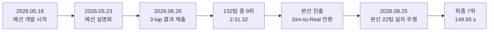
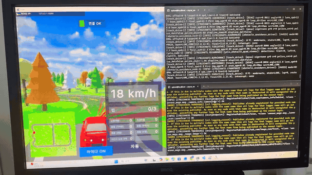
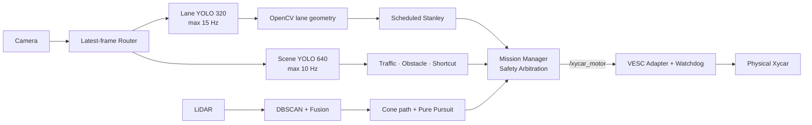
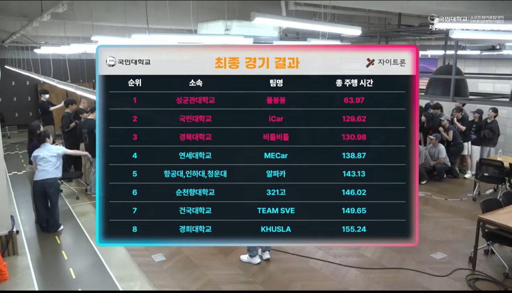

<p align="center">
  
</p>

# Kookmin University Autonomous Driving Competition 2026

국민대학교 제9회 자율주행 경진대회에 Team SVE로 참가해 예선 simulator부터 본선 Xycar 실차까지 개발한 과정을 정리한 포트폴리오 저장소다. 예선에서는 rule-based FSM, classical vision, PID를 이용해 3-lap 주행을 완주했고, 본선에서는 YOLO/OpenCV/LiDAR, Stanley/Pure Pursuit, Mission Manager와 VESC safety boundary를 통합했다.

> **Qualifying Round: 132팀 중 9위 · 3-lap 2분 31.32초**<br>
> **Main Round: 전체 132팀 → 본선 22팀 → 최종 7위 · 149.65초**

## Competition Journey



프로젝트 개발 기간은 2026.05.18–2026.06.26이었다. 공식 일정상 예선 설명회는 2026.05.23, 연장된 제출 마감은 2026.06.26이었다. [대회 공식 일정](https://auto-contest.kookmin.ac.kr/%ED%99%88)에서 별도로 확인할 수 있다.

| Round | Platform | Core approach | Result | Detail |
|---|---|---|---:|---|
| Qualifying Round | 국민대학교 공식 simulator | FSM, classical vision, PID lane control | **132팀 중 9위, 2:31.32** | [예선 포트폴리오](qualifying_round/README.md) |
| Main Round | 1/10-scale Xycar | YOLO/OpenCV/LiDAR, Stanley, Pure Pursuit, Mission Manager | **본선 22팀 중 최종 7위, 149.65 s** | [본선 포트폴리오](docs/MAIN_ROUND.md) |

예선 순위·기록·참가 규모는 사용자가 제공한 최종 결과를 기준으로 적었다. 공개한 leaderboard 캡처에서는 Team SVE의 9위, 2분 31.32초, 제출 11회를 확인할 수 있다. 캡처 화면의 표시 팀 수는 50개 팀이며 전체 참가 규모 132팀은 사용자 제공 정보다.

## Qualifying Round — Simulator

<p align="center">
  <a href="qualifying_round/media/qualifying_run.mp4">
    
  </a>
</p>

<p align="center"><strong><a href="qualifying_round/media/qualifying_run.mp4">▶ 예선 simulator 전체 주행 영상 재생</a></strong></p>

README에서는 연속 주행 16초를 2배속 8초 GIF로 바로 재생한다. 위 영상을 누르면 2분 47초 전체 MP4가 열린다.

예선에서는 camera ROI와 BEV 변환, HSV 기반 흰색·노란색 차선 분리, sliding-window 추적, lane path 생성, PID 조향을 연결했다. 콘 구간, 신호등과 경찰차 맥락, 좌회전, lap counting, finish 판정을 FSM으로 관리했다. 초기 Pure Pursuit 실험에서 직선 진동을 확인한 뒤 최종 차선 제어를 PID로 전환했고, 전체 pipeline 개선으로 276.00초에서 151.32초까지 124.68초(45.2%)를 줄였다.

| Qualifying contribution | 수행 내용 |
|---|---|
| FSM·mission integration | 콘→차선 전환, 경찰차/신호 분기, 좌회전, lap/finish 흐름을 통합했다. |
| Lane perception | ROI→BEV→HSV mask→sliding window pipeline을 구현·조정했다. |
| Path & control | 차선 우선순위와 목표 path를 만들고 PID 조향·속도 정책을 튜닝했다. |
| Debugging | RViz overlay로 mask, 차선 점, path와 오인식 원인을 확인했다. |

[예선 설계·실험·근거 전체 보기](qualifying_round/README.md) · [leaderboard 원본](qualifying_round/media/leaderboard.png) · [평가 계산](qualifying_round/evaluation/README.md)

## From Qualifying to Main

| Engineering axis | Qualifying Round | Main Round | 전환 이유 |
|---|---|---|---|
| Environment | 공식 simulator | 실제 Xycar Y | 조명·왜곡·지연·구동 비대칭을 다뤄야 했다. |
| Perception | HSV mask + sliding window | Dual YOLO + OpenCV + LiDAR fusion | 실제 장면의 객체·장애물·콘을 함께 인식해야 했다. |
| Lane control | PID | Scheduled Stanley | 속도와 곡률에 따라 횡오차·heading을 함께 다뤘다. |
| Cone control | Pure Pursuit 초기 실험 | Spline path + Pure Pursuit | waypoint 기반 추종이 콘 중앙 경로에 적합했다. |
| Decision | rule-based FSM | Mission Manager + freshness/safety arbitration | 여러 perception source와 actuator 안전 경계를 통합했다. |
| Validation | 3-lap time, RViz visual debug | rosbag replay, calibration CSV, watchdog test | 실차에서 재현 가능한 정량 근거와 fail-safe가 필요했다. |

예선에서 얻은 핵심 교훈은 controller 하나만 바꾸는 것으로 성능이 결정되지 않는다는 점이었다. perception 안정화, mission transition, path 생성, 속도 정책과 debugging을 함께 개선한 경험을 본선의 모듈형 perception-control interface와 안전 중심 Mission Manager 설계로 확장했다.

## Main Round — Real Vehicle

### Competition Run / 실제 대회 주행

<p align="center">
  
</p>

<p align="center"><strong><a href="media/video/competition_drive_2x.mp4">▶ 본선 연속 주행 MP4 재생</a></strong></p>

저장소에 본선 주행 영상을 직접 포함했다. 전체 방송 맥락은 [공식 영상의 Team SVE 구간](https://youtu.be/CcfXS3UFL0A?t=17782)에서 확인할 수 있으며, 별도의 팀 촬영 자료인 [콘 구간 실차 16초](media/video/cone_course_run.mp4)도 함께 보존했다.

### Project Overview

| 항목 | 내용 |
|---|---|
| Competition | 제9회 국민대학교 자율주행 경진대회, Team SVE |
| Vehicle | 1/10-scale Xycar, fisheye camera, 2D LiDAR, VESC |
| Runtime | Ubuntu 22.04, ROS 2 Humble, Fast DDS |
| Goal | lane, traffic light, dynamic/static obstacle, shortcut left-turn, cone mission을 end-to-end로 통합했다. |
| Project type | 팀 프로젝트이며 아래 contribution은 직접 담당·주도한 영역을 코드와 연결해 기록했다. |

### My Main Round Contribution

| 담당 영역 | 수행 내용 | 관련 코드 |
|---|---|---|
| Camera Perception | Lane/Scene YOLO 분리, confidence·input size·실행 주기를 튜닝했다. | [`yolo_node.py`](ros2_ws/src/cam/cam/yolo_node.py), [`frame_router.py`](ros2_ws/src/cam/cam/frame_router.py) |
| Lane Geometry & Control | YOLO+OpenCV lane geometry와 Stanley를 설계하고 gain/speed를 튜닝했다. | [`Lane_Detector.py`](ros2_ws/src/cam/cam/Lane_Detector.py), [`Integrated_Stanley_Controller.py`](ros2_ws/src/cam/cam/Integrated_Stanley_Controller.py) |
| Mission Integration | `STOP/PAUSED/LANE/OVERTAKE/CONE` arbitration, freshness와 VESC fail-safe를 통합했다. | [`mission_manager_node.py`](ros2_ws/src/mission_cone_drive/mission_cone_drive/mission_manager_node.py) |
| Obstacle Perception | dynamic/static YOLO와 LiDAR를 연결하고 목표 차선·speed/event parameter를 튜닝했다. | [`target_lane_planner.py`](ros2_ws/src/cam/cam/target_lane_planner.py), [`obstacle_lidar_fusion.py`](ros2_ws/src/cam/cam/obstacle_lidar_fusion.py) |
| Shortcut Left Turn | left signal 인식과 진입/회전/이탈 FSM을 통합했다. | [`traffic_light_node.py`](ros2_ws/src/cam/cam/traffic_light_node.py), [`shortcut_left_turn_logic.py`](ros2_ws/src/cam/cam/shortcut_left_turn_logic.py) |
| Sim-to-Real | 차량 치수·조향·속도를 실측하고 좌우 LUT와 Gazebo interface를 보정했다. | [`simulation/xycar_gz_sim/`](simulation/xycar_gz_sim/), [실차 calibration](docs/REAL_VEHICLE_CALIBRATION.md) |

팀 전체 구현을 혼자 했다는 의미가 아니다. 위 영역을 담당·주도하고 통합·튜닝했다. 공개 Git history는 개발 중간 이력을 한 commit으로 가져온 형태라 파일별 개인 기여를 commit 통계로 분리할 수 없으므로 사용자 제공 역할 정보를 기준으로 작성했다.

### Validation & Results

검증 가능한 A–D class 수치만 사용했다. 원시 입력과 계산식은 링크한 문서와 CSV에 있다.

| Result | Value | Evidence |
|---|---:|---|
| Final perception configuration | Lane 320 px / 최대 15 Hz, Scene 640 px / 최대 10 Hz | [final start script](scripts/start_integrated_drive_container.sh), [architecture](docs/ARCHITECTURE.md) |
| Unsafe S-curve 10→16 acceleration | Run 02 **7→0**, Run 03 **3→0**; 두 replay 모두 100% 제거 | [manifest](evaluation/validation_manifest.json), [validation](docs/VALIDATION_EVIDENCE.md) |
| Measured 5 m speed | command 4: 0.399 m/s, command 25: 2.222 m/s; **5.57×** | [raw CSV](evaluation/calibration/speed_5m_measurements.csv), [calibration](docs/REAL_VEHICLE_CALIBRATION.md) |
| Steering asymmetry at \|raw\| 40 | right 0.5525 m vs left 0.8200 m; left radius **48.4% larger** | [raw CSV](evaluation/calibration/steering_circle_measurements.csv) |
| Gazebo max-steer radius replay | right 0.9%, left 1.9% absolute error at ±40 | [comparison](evaluation/calibration/sim_real_comparison.csv), [limits](docs/SIM_TO_REAL.md) |
| Competition second run | driving 144.65 s + penalty 5.00 s = **149.65 s** | [result image](media/competition/final-result-149-65s.jpg), [retrospective](docs/COMPETITION_RETROSPECTIVE.md) |
| Final ranking | 전체 132팀 → 본선 22팀 → **최종 7위** | [final ranking](media/competition/final-ranking-7th.png), [retrospective](docs/COMPETITION_RETROSPECTIVE.md) |

`cte_px` replay는 image-plane lane-center proxy이며 실제 vehicle pose error가 아니다. 최대 조향 sim-real 수치도 calibrated LUT knot 재현 결과이며 전체 trajectory accuracy로 일반화하지 않았다.

### System Architecture



[Detailed Architecture](docs/ARCHITECTURE.md)

### Perception

- **Dual YOLO:** center-line 전용 320 px branch와 cone/dynamic/green/left/red/static 640 px branch를 분리했다.
- **Latest-frame routing:** worker가 바쁜 동안 오래된 FIFO를 쌓지 않고 pending frame을 최신 입력으로 교체했다.
- **YOLO + OpenCV hybrid:** YOLO ROI 안에서 adaptive threshold, Canny, Hough와 polynomial fit으로 lane geometry를 만들었다.
- **LiDAR:** rotated scan을 DBSCAN으로 묶고 최대 지름 0.30 m 등의 조건으로 cone 후보를 만들었다.
- **Camera-LiDAR fusion:** fisheye projection으로 obstacle/cone image box와 LiDAR cluster를 연결했다.

Single→dual pipeline의 동등 조건 FPS log는 저장소에 없어 “N% 빨라졌다”고 적지 않았다. 최종 운용값과 code default의 차이는 [Dual YOLO 문서](ros2_ws/src/mission_cone_drive/DUAL_YOLO_PIPELINES.md)에 명시했다.

### Decision & Planning

- Mission Manager는 `STOP`, `PAUSED`, `LANE`, `OVERTAKE`, `CONE` 상태와 `PAUSED > RED/STOP > CONE > LANE/OVERTAKE` 우선순위를 적용했다.
- Traffic light는 red/green/left class와 latch/confirmation을 사용했다. final red threshold는 0.30, code default는 0.20이다.
- Dynamic/static obstacle은 같은 obstacle Stanley k를 공유하지만 speed cap, trigger distance, lane-change distance와 event duration을 다르게 설정했다.
- Shortcut FSM은 left signal, base lane curve, cross-line/alignment confirmation을 이용해 좌회전 진입과 lane handoff를 관리했다.
- Cone entry는 YOLO box, LiDAR cluster, 양쪽 cone evidence와 path point 수를 확인한 뒤 mode를 전환했다.

### Control & Safety

- **Lane:** Stanley의 CTE gain을 command 4–12에서 scheduling했다. straight `1.00→0.65`, curve `1.20→0.90`, obstacle override `1.80`을 사용했다.
- **Heading:** low-speed 0.30에서 straight 0.18, Hough 0.14, curve 0.30으로 context-aware weight를 사용했다.
- **Cone:** final launcher는 DBSCAN spline path + Pure Pursuit를 선택했다. cone Stanley/preview 코드는 대안·회귀시험용으로 남겼다.
- **Speed:** curvature severity와 S-reversal을 반영하고 command 변화율을 제한했다.
- **Freshness:** camera header를 `LaneControlStateV3 → StampedMotorCommand`까지 보존하고 stale state에서 speed 0을 냈다.
- **Actuator:** MotorCommandAdapter가 servo/duty conversion, ERPM feed-forward + PI, slew limit와 0.30초 watchdog을 수행했다.

### Sim-to-Real

실측 wheelbase 0.355 m, track 0.250/0.266 m, wheel radius 0.050 m와 mass 4.1 kg을 vehicle model에 반영했다. 좌우 steering 반경이 크게 달라 direction-specific curvature LUT를 사용했고 5 m timing으로 speed LUT를 만들었다.


Gazebo에서 64초 이상 주행과 right turn을 확인했지만 sharp S-curve 후반 left에서 lane loss 후 safety stop했다. camera pose, tire model, steering/motor delay와 영상 domain gap이 남아 있어 완전한 digital twin으로 표현하지 않았다. [측정표와 계산](docs/REAL_VEHICLE_CALIBRATION.md) · [Sim-to-Real 한계](docs/SIM_TO_REAL.md)


### Engineering Iterations

| Problem | Engineering change | Verified result / honest limit |
|---|---|---|
| Camera backlog와 stale control | latest-frame worker + stamped contract + 0.30초 stop을 적용했다. | backlog 방지 구조와 timeout을 확인했으며 latency 개선률 데이터는 없다. |
| Single multi-class YOLO trade-off | Lane 320/15와 Scene 640/10으로 분리했다. | final configuration을 확인했으며 single-model FPS 비교는 없다. |
| Target point만으로 부족 | curvature/confidence/S-reversal/timestamp로 interface를 확장했다. | V1→V3 nested message와 stamped command를 확인했다. |
| Fixed Stanley gain trade-off | speed/context gain scheduling을 적용했다. | final values를 확인했으며 tracking-error before/after는 없다. |
| S-curve 조기 가속 | 3-speed policy + 0.5초 exit hold를 적용했다. | Run 02 7→0, Run 03 3→0으로 줄었다. |
| Unseen broadcast red light | threshold/confirmation을 재검토하고 context gating 필요성을 도출했다. | 경기 실패를 공개했으며 current config만으로 완전히 해결했다고 주장하지 않았다. |

[전체 Problem → Measurement → Change → Validation → Result → Limitation 기록](docs/ENGINEERING_ITERATIONS.md)

### Competition Result & Failure Analysis

| Team SVE operation | Second-run result |
|:---:|:---:|
|  |  |

<p align="center">
  
</p>

전체 132팀 중 예선을 통과한 22팀이 본선에 진출했고 Team SVE는 최종 7위를 기록했다. 최종 순위 화면에서 건국대학교 Team SVE의 7위와 총 주행 시간 149.65초를 확인할 수 있다. 전체 참가 규모 132팀과 본선 진출 규모 22팀은 사용자 제공 정보로 구분했다.

본선 2차 주행은 144.65초, penalty 5.00초, final 149.65초였다. 사용자 회고상 연습 때 없던 방송 카메라의 red indicator를 신호등으로 오인해 약 45초 STOP했다. 45초는 동기화 log가 아닌 manual review 근사값이며, 이를 뺀 104.65초는 공식 기록이 아니라 단순 hypothetical이다.

이 실패를 낮은 confidence의 trade-off, closed-set validation의 한계, ROI/location/geometry gating과 N-of-M temporal confirmation 필요성으로 연결했다. 외부 red source를 가린 현장 조치는 software fix로 서술하지 않았다. [상세 경기 회고](docs/COMPETITION_RETROSPECTIVE.md)

### Main Round Robotics Stack

| Layer | Stack |
|---|---|
| Language | Python, Bash |
| Robotics | ROS 2 Humble, DDS/Fast DDS, Topics/Services, `custom_interfaces` |
| Perception | OpenCV, Ultralytics YOLOv10n, Camera-LiDAR Fusion, DBSCAN |
| Planning / Control | FSM, Stanley, Pure Pursuit, gain scheduling, speed planning, PI motor control |
| Simulation | Gazebo, Ackermann vehicle model, asymmetric steering/speed LUT, Sim-to-Real calibration |
| Development / Validation | Ubuntu 22.04, Git/GitHub, colcon/ament, rosbag replay, latency/freshness tools |

## Repository Structure

```text
Kookmin2026/
├── qualifying_round/             # 예선 simulator 설계·기록·영상·평가
│   ├── README.md
│   ├── evaluation/
│   └── media/
├── docs/                         # 본선 설계·알고리즘·운용·검증 문서
│   ├── MAIN_ROUND.md             # 본선 landing page
│   ├── ARCHITECTURE.md
│   ├── ENGINEERING_ITERATIONS.md
│   └── COMPETITION_RETROSPECTIVE.md
├── evaluation/                   # 본선 평가 데이터와 재현 자료
├── media/                        # 본선 실차·대회·simulation 자료
├── ros2_ws/                      # 본선 ROS 2 실차 workspace
├── scripts/                      # 본선 통합 주행 실행과 환경 설정
├── simulation/                   # 본선 Sim-to-Real Gazebo 환경
└── tools/                        # 본선 분석·검증 도구
```

예선 원본 source는 현재 공개 Git history에 남아 있지 않아 `qualifying_round/src/`를 만들지 않았다. `simulation/team_code/track_drive`는 본선 Sim-to-Real 과정에서 정리한 후속 adapter이며 예선 원본 코드로 간주하지 않았다.

## Build / Run

본선 기준 환경은 Ubuntu 22.04 / ROS 2 Humble이다. 실제 차량 실행 전 camera, LiDAR, VESC port와 emergency stop을 확인해야 한다. 예선 ROS 2 distribution은 남은 근거만으로 특정하지 않았다.

```bash
cd ros2_ws
source /opt/ros/humble/setup.bash
colcon build --symlink-install
source install/setup.bash

# repository root에서 host backend 실행
cd ..
XYCAR_EXECUTION_BACKEND=host ./scripts/start_integrated_drive_container.sh
```

시작 시 motor는 비활성 상태다. 자세한 안전 절차와 backend 조건은 [Operations](docs/OPERATIONS.md), Gazebo build/run은 [Sim-to-Real](docs/SIM_TO_REAL.md)를 따른다.

## Documentation

- [Qualifying Round Portfolio](qualifying_round/README.md)
- [Main Round Portfolio](docs/MAIN_ROUND.md)
- [System Architecture](docs/ARCHITECTURE.md)
- [Engineering Iterations](docs/ENGINEERING_ITERATIONS.md)
- [Algorithms](docs/ALGORITHMS.md)
- [Real Vehicle Calibration](docs/REAL_VEHICLE_CALIBRATION.md)
- [Sim-to-Real](docs/SIM_TO_REAL.md)
- [Competition Retrospective](docs/COMPETITION_RETROSPECTIVE.md)
- [Validation Evidence](docs/VALIDATION_EVIDENCE.md)
- [Operations](docs/OPERATIONS.md)
- [Models](docs/MODELS.md)
- [Sources & Licenses](docs/SOURCE_AND_LICENSES.md)

## Evidence Boundary

예선 상세 설계와 전체 참가 규모는 사용자 제공 개발 기록을 기준으로 복원했고 leaderboard 캡처와 주행 영상이 남은 항목을 분리해 표시했다. 예선 원본 source, simulator replay 파일과 rosbag은 공개 저장소에 없다. 본선 원본 rosbag과 전체 학습 dataset도 용량·개인정보 때문에 포함하지 않았다. 현재 자료로 정량화할 수 없는 sensor-to-command latency 개선률, Stanley tracking-error 개선률, 전체 trajectory-level sim-real error는 결과 수치에서 제외했다.
