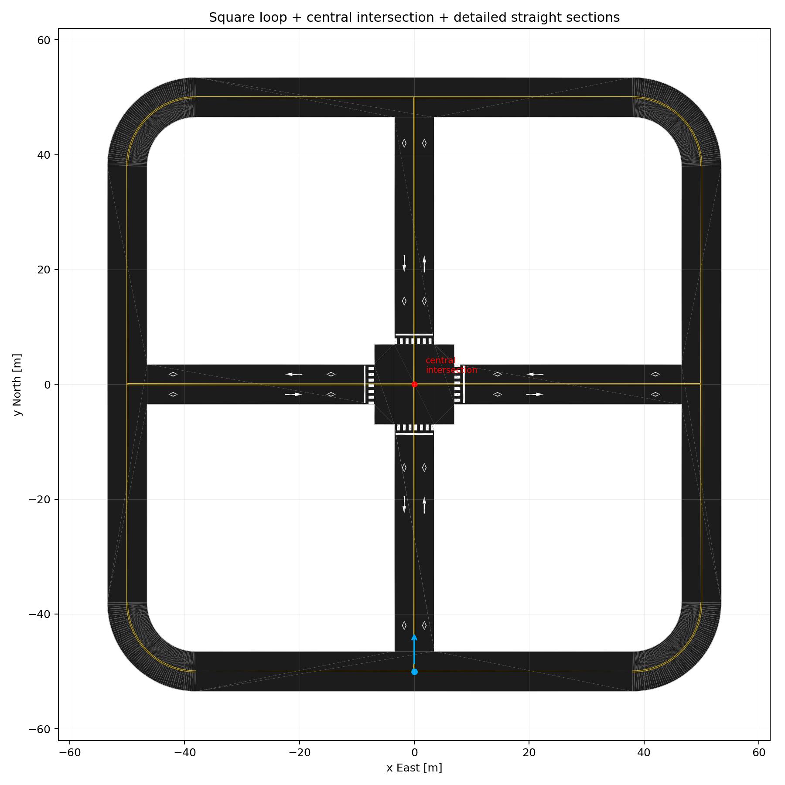
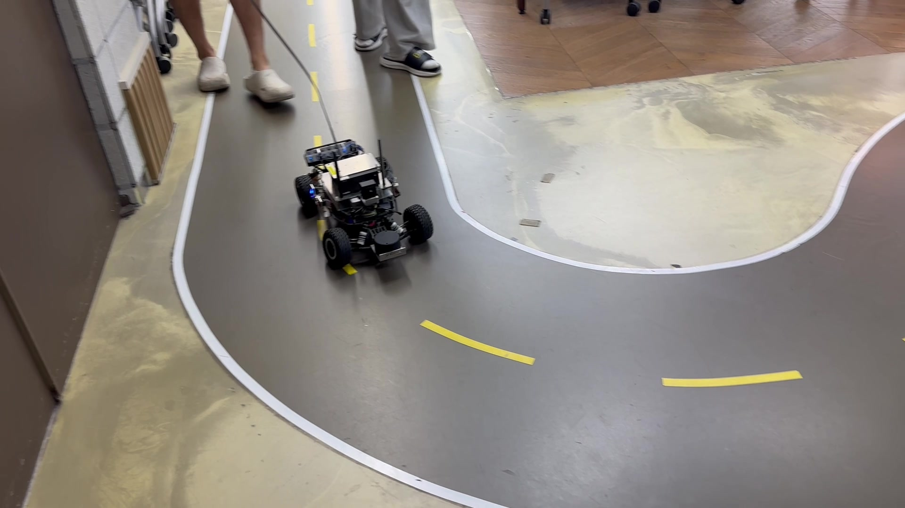
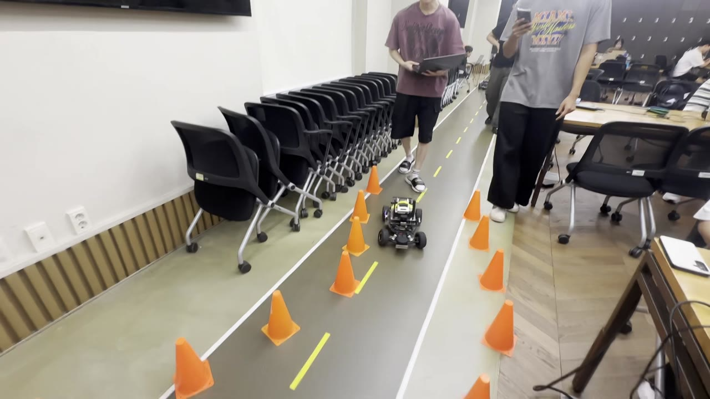
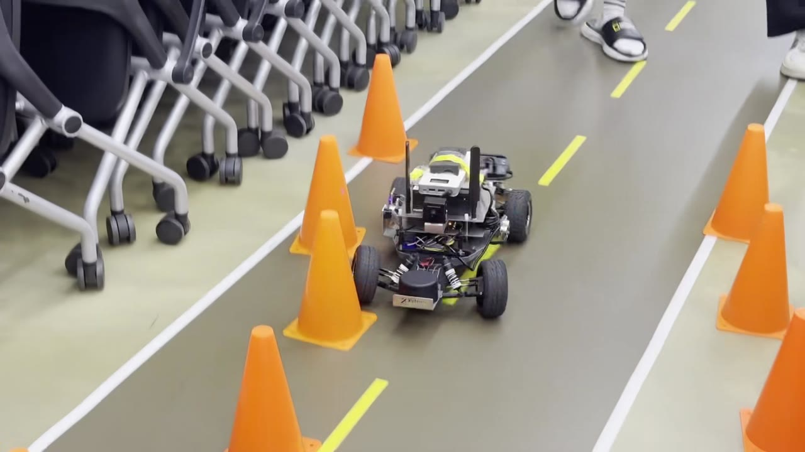
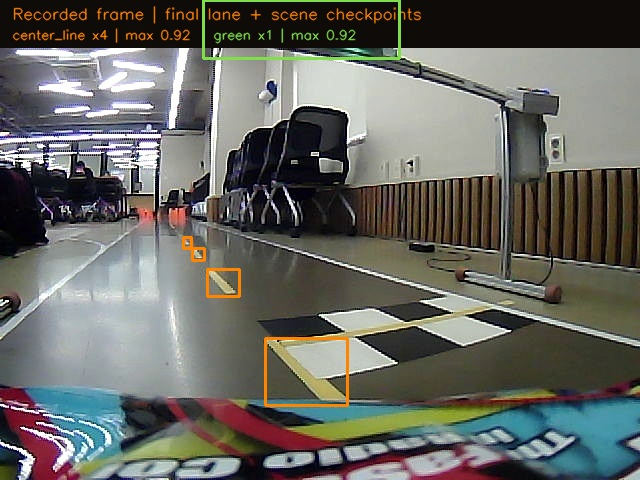
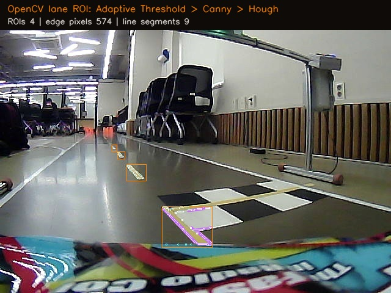
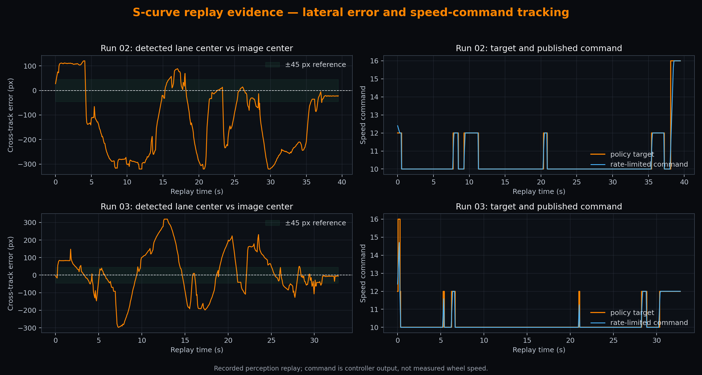
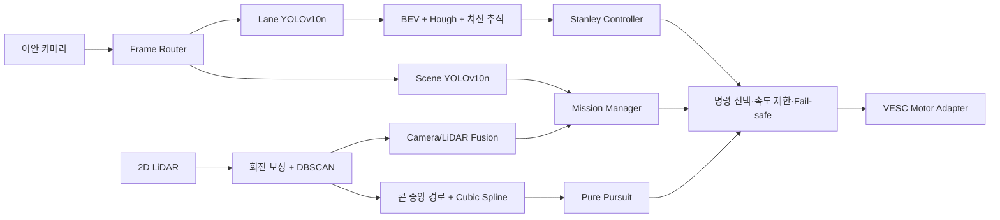

<p align="center">
  
</p>

# Kookmin 2026 Autonomous Driving

국민대학교 제9회 자율주행 경진대회를 준비하며 개발한 Xycar 기반 ROS 2 자율주행 시스템입니다. 최종 주행 코드, 센서 드라이버, Gazebo 환경, 실차 보정값과 분석 도구를 한 저장소에 정리했습니다.

카메라와 LiDAR를 함께 사용해 차선·신호·콘·장애물을 인지하고, 유한상태기계가 현재 미션과 안전 우선순위를 결정합니다. 일반 차선에서는 Stanley 제어기, 콘 구간에서는 DBSCAN으로 만든 중앙 경로와 Pure Pursuit 제어기를 사용합니다.

## 주행 기록

| Gazebo 코스 | 실차 트랙 테스트 | 콘 구간 테스트 |
|:---:|:---:|:---:|
|  |  |  |

촬영 영상에서 저장소 소개용 프레임만 추출했으며 위치·시간 메타데이터는 제거했습니다.

## 실차 주행 영상

<p align="center">
  <a href="media/video/cone_course_run.mp4">
    
  </a>
</p>

<p align="center">
  <strong><a href="media/video/cone_course_run.mp4">▶ 콘 구간 실차 주행 16초 영상 재생</a></strong>
</p>

HEVC 원본을 GitHub와 브라우저에서 확인하기 쉬운 H.264 960×540 영상으로 변환했습니다. 음성과 메타데이터를 제거했으며 인코딩 정보와 SHA-256은 [영상 기록](media/video/README.md)에 남겼습니다.

## 인지 및 추종 검증

| 최종 YOLO 체크포인트 출력 | YOLO ROI의 OpenCV 후처리 |
|:---:|:---:|
|  |  |



실차 카메라 기록에 최종 Lane YOLO(320)와 Scene YOLO(640)를 다시 실행해 중앙선 후보 4개와 녹색 신호 1개를 기록했습니다. Lane YOLO가 잡은 영역에는 실제 중앙선 추적과 같은 Adaptive Threshold → Canny → Hough 단계를 적용했습니다.

S자 리플레이 2회에서는 10/12/16 속도 정책의 목표와 출력 명령을 비교했습니다. 곡선 이탈 hold를 적용한 정책은 기존 정책에서 각각 7회, 3회 발생하던 검증되지 않은 10→16 직접 가속을 두 기록 모두 0회로 줄였습니다. 왼쪽의 `cte_px`는 영상에서 본 차선 중심 오차이며 실제 차량 pose 오차는 아닙니다. 입력 체크섬, 수치와 해석 범위는 [인지 및 추종 검증 자료](docs/VALIDATION_EVIDENCE.md)에 있습니다.

## 시스템 구성



| 구분 | 적용한 방법 | 역할 |
|---|---|---|
| 인지 | YOLOv10n 2개, 어안 보정, BEV, Canny/Hough, LiDAR DBSCAN, 카메라-LiDAR 투영 | 중앙선, 신호등, 지름 0.30 m 이하 콘 후보, 정적·동적 장애물 검출 |
| 판단 | `LANE`/`CONE` 상태기계, N-of-M 확인, 신호 적색 래치, 장애물 추적, 지름길 단계 전이 | 순간 오검출을 걸러 미션 모드·목표 차선·속도 상한 결정 |
| 제어 | 속도별 이득을 쓰는 Stanley, Pure Pursuit, 곡률별 속도 정책, 조향·속도 변화율 제한 | 차선 및 콘 중앙 경로 추종, 급격한 명령 억제 |
| 안전 | 메시지 freshness, VESC 준비 확인, pause/stop/reset 서비스 | 센서나 명령이 오래되거나 구동기가 준비되지 않으면 정지 명령 출력 |

구현과 파라미터의 근거는 [알고리즘 문서](docs/ALGORITHMS.md), 노드 연결은 [아키텍처 문서](docs/ARCHITECTURE.md)에 자세히 적었습니다.

## Sim-to-Real

실차와 Gazebo가 동일한 ROS 인터페이스를 사용합니다.

- 입력: `/image_raw`, `/camera_info`, `/scan`
- 출력: `/cmd/speed`, `/cmd/steer`
- 구동기 경계: `/xycar_motor` 배열 `[steer, speed]`
- 차량 모델: rear axle 중심 `base_link`, 전륜 Ackermann 조향, 후륜 구동
- 보정: 좌·우 비대칭 raw steering↔curvature LUT와 speed command↔m/s LUT

알고리즘을 바꾸지 않고 실행 백엔드와 센서/구동기만 전환하도록 구성했습니다. Gazebo에서 64초 이상 연속 주행과 우회전 구간 통과를 확인했지만, 급한 S자 후반 좌회전은 카메라 pose와 좌회전 조향 반경의 추가 실측 보정이 필요합니다. 검출이 끊기면 계속 진행하지 않고 속도 0을 발행합니다. 상세 내용은 [Sim-to-Real 기록](docs/SIM_TO_REAL.md)에 있습니다.

## 저장소 구조

```text
Kookmin2026/
├── ros2_ws/src/
│   ├── cam/                    # 영상 인지, 차선 추정, Stanley 제어
│   ├── custom_interfaces/      # 주행 상태·디버그 메시지
│   ├── mission_cone_drive/     # 미션 FSM, 센서 융합, 콘 경로·제어
│   ├── xycar_motor_native/     # VESC 명령 변환
│   └── vendor/                 # usb_cam, VESC, Xycar 장치 드라이버
├── simulation/                 # Gazebo 차량·코스와 초기 차선주행 코드
├── scripts/                    # 통합 주행 실행 스크립트
├── tools/                      # 지연·freshness·주행 로그 분석
├── media/                      # 시뮬레이션과 실차 기록 이미지
└── docs/                       # 설계, 알고리즘, 운용 및 출처 문서
```

## 빌드와 실행

기준 환경은 Ubuntu 22.04, ROS 2 Humble입니다. 실제 차량 실행 전 카메라, LiDAR, VESC 포트와 보정 파일을 차량에 맞게 확인해야 합니다.

```bash
cd ros2_ws
source /opt/ros/humble/setup.bash
colcon build --symlink-install
source install/setup.bash
```

호스트에서 통합 스택을 실행합니다. 안전을 위해 기본값은 `start_active:=false`이며 시작 서비스를 호출하기 전까지 모터 명령을 활성화하지 않습니다.

```bash
cd ..
XYCAR_EXECUTION_BACKEND=host ./scripts/start_integrated_drive_container.sh
```

팀에서 사용한 컨테이너 이미지가 로컬에 있다면 기본 container 백엔드를 사용할 수 있습니다. 재현 가능한 실행 순서와 서비스 명령은 [운용 문서](docs/OPERATIONS.md)를 참고하십시오.

Gazebo 패키지는 별도 install 경로로 빌드할 수 있습니다.

```bash
source /opt/ros/humble/setup.bash
colcon --log-base simulation/log build --symlink-install \
  --base-paths simulation/xycar_gz_sim simulation/team_code/track_drive \
  --build-base simulation/build \
  --install-base simulation/install
source simulation/install/setup.bash
ros2 launch xycar_gz_sim xycar.launch.py use_sim:=true gui:=true
```

초기 차선주행 코드까지 연결한 비교 실행은 `team_lane_sim.launch.py`를 사용합니다.

```bash
ros2 launch xycar_gz_sim team_lane_sim.launch.py use_sim_time:=true gui:=true
```

## 모델과 자료 범위

최종 주행에서 사용한 YOLOv10n 체크포인트는 `ros2_ws/src/cam/cam/`에 포함했으며 역할과 checksum은 [모델 문서](docs/MODELS.md)에 기록했습니다. 대형 범용 YOLO 데모 가중치, 빌드 결과, 캐시, rosbag 원본, 연습 패키지는 저장소에서 제외했습니다. 대회 규정 PDF와 원본 DXF는 재배포 조건이 확인되지 않아 포함하지 않고, 규정에서 필요한 임무 순서만 [대회 요구사항](docs/COMPETITION_REQUIREMENTS.md)에 직접 요약했습니다.

외부 드라이버의 라이선스와 코드 출처는 [소스 및 라이선스](docs/SOURCE_AND_LICENSES.md)에 구분해 기록했습니다. 이 저장소 전체에 일괄 적용되는 별도 라이선스는 선언하지 않습니다.

정리 후 알고리즘 단위 테스트 283개와 Gazebo 패키지 빌드를 통과했습니다. 현재 PC에서 추가로 필요한 실차 driver dependency까지 포함한 결과는 [검증 기록](docs/VALIDATION.md)에 남겼습니다.
