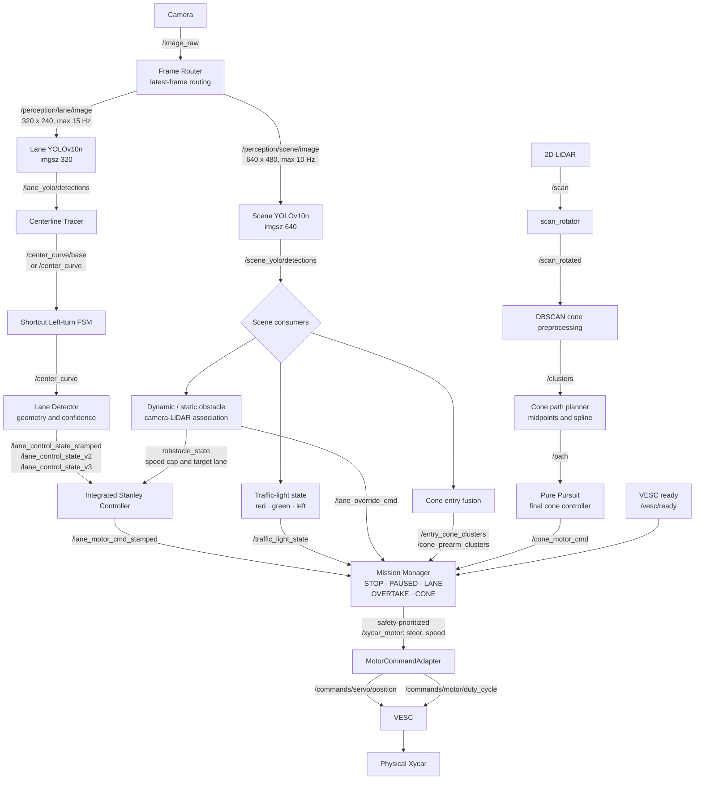
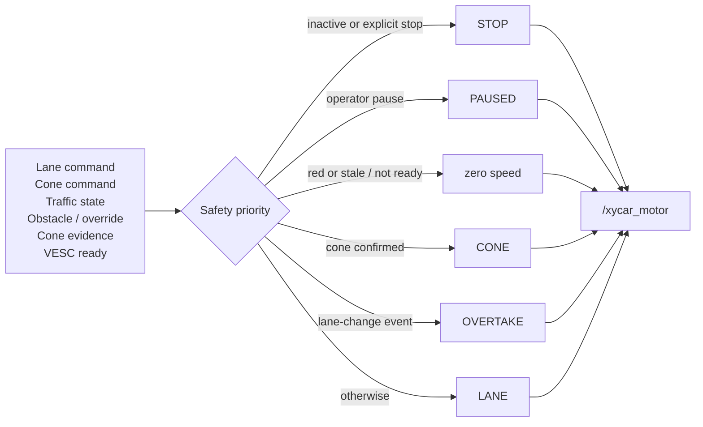

# 시스템 아키텍처

이 문서는 `main`의 실제 노드와 `scripts/start_integrated_drive_container.sh`의 최종 대회 실행값을 기준으로 작성했다. `integrated_drive.launch.py`의 기본값은 단독 시험을 위한 호환값일 수 있으므로 아래에서 **Code default**와 **Competition / final launch**를 구분한다.

## End-to-end data flow

`shortcut_left_turn_node`가 활성화된 최종 실행에서는 `centerlane_tracer`가 `/center_curve/base`를 발행하고 shortcut FSM이 최종 `/center_curve`를 만든다. shortcut이 비활성화되면 tracer가 `/center_curve`를 직접 발행한다.

## Mission arbitration과 안전 우선순위

`mission_manager_node`는 단순 mux가 아니다. stamped lane command의 수신 시각·명령 시각·원본 perception 시각을 검사하고, cone evidence와 VESC readiness를 함께 확인한 뒤 최종 명령을 선택한다.

코드에 기록된 우선순위는 `PAUSED > RED/STOP > CONE > LANE/OVERTAKE`다. 최종 스크립트의 주요 안전값은 다음과 같다.

| 항목 | Competition / final launch | Code default | 근거 |
|---|---:|---:|---|
| Lane source freshness | 0.30 s | 0.80 s | `stanley_state_timeout_s`; Mission Manager에도 동일 값 전달 |
| Motor adapter watchdog | 0.30 s | 0.30 s | `xycar_motor_native/motor_command_adapter.py` |
| VESC readiness timeout | 1.25 s | 1.25 s | `mission_manager_node.py` |
| Traffic red threshold | 0.30 | 0.20 | final script override vs node/launch default |
| Red confirmation before latch | 2 frames | node default 1 frame | final script override |

오래된 lane state에서는 Stanley가 마지막 조향각을 보존할 수 있지만 속도는 0으로 내린다. 이후 Mission Manager와 motor watchdog이 각각 source/command freshness를 다시 확인하므로 마지막 명령이 무기한 유지되지 않는다.

## Perception rates: default와 최종 운용값

| Pipeline | Code default | Competition / final launch | 목적 |
|---|---:|---:|---|
| Lane router | 12 Hz | **최대 15 Hz** | 조향 반응성 우선 |
| Lane inference | router 상한, 별도 cap 없음 | **imgsz 320, 최대 15 Hz** | center-line 전용 |
| Scene router | compatibility default 4 Hz | **최대 10 Hz** | 장애물·신호·콘 분류 |
| Scene inference | router 상한, 별도 cap 없음 | **imgsz 640, 최대 10 Hz** | 해상도와 class 분리 우선 |

`frame_router`와 각 YOLO worker는 depth가 긴 FIFO backlog를 순서대로 처리하지 않는다. 최신 프레임 슬롯을 새 입력으로 교체하고 worker가 준비될 때 가장 최근 프레임을 가져가는 방식이므로 처리량이 순간적으로 낮아져도 오래된 프레임이 누적되지 않는다. 저장소에는 같은 입력의 before/after sensor-to-command latency 로그가 없어 개선율은 산출하지 않았다.

## 주요 노드별 책임

| 패키지 | 노드/모듈 | 책임 |
|---|---|---|
| `cam` | `frame_router.py` | 하나의 카메라 stream을 최신 프레임 기반 lane/scene branch로 분배하고 rate 제한 |
| `cam` | `yolo_node.py` | lane/scene 체크포인트 로드, 추론, class alias와 confidence 적용 |
| `cam` | `centerlane_tracer.py` | YOLO ROI에 OpenCV 후처리를 적용해 중심 곡선 생성 |
| `cam` | `Lane_Detector.py` | BEV 차선 역할 추적, CTE·heading·curvature·confidence와 S-reversal state 산출 |
| `cam` | `traffic_light_node.py` | direct red/green/left 판정, N-of-M/래치 정책, `/traffic_light_state` 발행 |
| `cam` | `target_lane_planner.py` | dynamic/static 장애물의 camera-LiDAR association, 목표 차선·speed cap 생성 |
| `cam` | `shortcut_left_turn_node.py` | 좌회전 신호와 차선 기하를 이용한 진입/회전/이탈 FSM |
| `cam` | `Integrated_Stanley_Controller.py` | lane state freshness 검사, scheduled Stanley·heading weight·speed policy 적용 |
| `mission_cone_drive` | `scan_rotator.py` | LiDAR 장착 방향 보정 |
| `mission_cone_drive` | `lidar_dbscan_preprocessing_node.py` | cone 후보 clustering과 크기·거리 필터 |
| `mission_cone_drive` | `cone_entry_fusion_node.py` | YOLO cone box와 LiDAR cluster의 fisheye projection 기반 결합 |
| `mission_cone_drive` | `lidar_dbscan_path_planning_node.py` | 좌우 cone 열의 midpoint와 spline `/path` 생성 |
| `mission_cone_drive` | `pure_pursuit_node.py` | 최종 대회 설정의 cone path 추종 |
| `mission_cone_drive` | `mission_manager_node.py` | 모드 전환, safety priority, command freshness, 최종 `/xycar_motor` 선택 |
| `xycar_motor_native` | `motor_command_adapter.py` | `[steer, speed]`를 servo position과 motor duty로 변환, ERPM PI와 watchdog 수행 |

## 핵심 토픽 계약

| 토픽 | 타입 / 핵심 필드 | 생산자 → 소비자 |
|---|---|---|
| `/image_raw` | `sensor_msgs/Image` | USB/Gazebo camera → `frame_router` |
| `/perception/lane/image` | `sensor_msgs/Image`, 320×240 | `frame_router` → lane YOLO / lane geometry |
| `/perception/scene/image` | `sensor_msgs/Image`, 640×480 | `frame_router` → scene YOLO / traffic logic |
| `/lane_yolo/detections` | `custom_interfaces/Detections` | lane YOLO → tracer / lane detector |
| `/scene_yolo/detections` | `custom_interfaces/Detections` | scene YOLO → traffic / obstacle / cone fusion / manager |
| `/center_curve/base` | `custom_interfaces/Curve` | tracer → shortcut FSM when enabled |
| `/center_curve` | `custom_interfaces/Curve` | tracer or shortcut FSM → lane detector / obstacle planner |
| `/lane_control_state_stamped` | `LaneControlState` | lane detector → Stanley |
| `/lane_control_state_v2`, `/lane_control_state_v3` | backward-compatible richer state | lane detector → Stanley |
| `/lane_motor_cmd_stamped` | `StampedMotorCommand` | Stanley → Mission Manager |
| `/traffic_light_state` | `std_msgs/String` | traffic-light node → Stanley / Mission Manager |
| `/obstacle_state` | `ObstacleState` | target-lane planner → Stanley |
| `/lane_override_cmd` | `std_msgs/String` | obstacle/shortcut/manager coordination |
| `/scan`, `/scan_rotated` | `sensor_msgs/LaserScan` | LiDAR → rotator → cone preprocessing |
| `/clusters`, `/path` | `ClusterData`, `nav_msgs/Path` | DBSCAN → path planner → cone controller / manager |
| `/cone_motor_cmd` | `Float32MultiArray [steer, speed]` | Pure Pursuit → Mission Manager |
| `/vesc/ready` | `std_msgs/Bool`, transient local | VESC driver → Mission Manager |
| `/xycar_motor` | `Float32MultiArray [steer, speed]` | Mission Manager → physical motor adapter |
| `/commands/servo/position` | `std_msgs/Float64` | motor adapter → VESC servo |
| `/commands/motor/duty_cycle` | `std_msgs/Float64` | motor adapter → VESC motor |

## Real과 simulation의 actuator boundary

실차 최종 스택은 `/xycar_motor → MotorCommandAdapter → VESC` 경로를 사용한다. Gazebo 단독 검증의 `/cmd/speed`와 `/cmd/steer`는 simulation adapter의 논리 명령 경계다. 따라서 `/cmd/*`를 실차 최종 VESC 출력 토픽으로 설명하면 안 된다. `team_motor_adapter_node`는 팀 형식 `/team/xycar_motor_cmd`를 simulation의 `/cmd/*`로 변환하는 별도 호환 경로다.

관련 문서: [알고리즘](ALGORITHMS.md) · [운용](OPERATIONS.md) · [Sim-to-Real](SIM_TO_REAL.md) · [실차 보정](REAL_VEHICLE_CALIBRATION.md)
