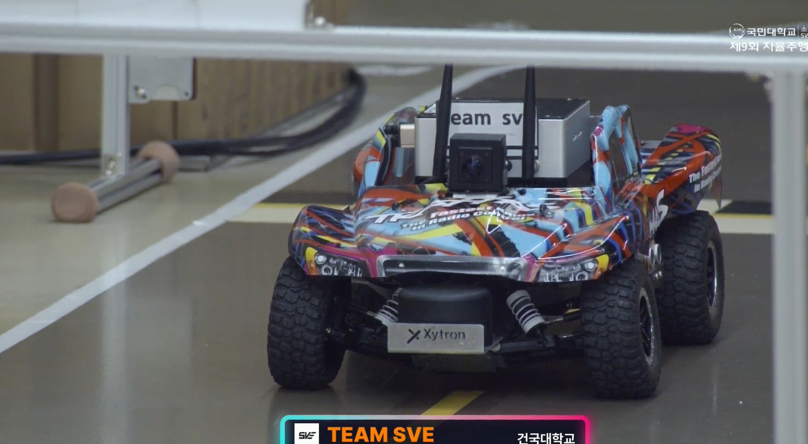

# 경기 결과와 실패 분석

## 공식 결과

사용자가 제공한 경기 결과 화면에서 다음 값을 직접 읽었다(C).

| 항목 | 값 |
|---|---:|
| Raw driving time | 144.65 s |
| Mission penalty | 5.00 s |
| Final time | **149.65 s** |

## Broadcast-camera red false positive

### 관찰

대회 당일 연습주행 환경에는 없던 방송 촬영 카메라가 추가됐다. 사용자 회고에 따르면 scene perception이 카메라의 큰 red indicator/light를 신호등 `red` class로 오인했고, 차량은 한 위치에서 **약 45 s** STOP 상태에 머물렀다.

공식 영상 전체 팀 구간은 [4:56:22–4:59:46](https://youtu.be/CcfXS3UFL0A?t=17782)이다. 차량이 연속 주행하는 4:56:45–4:57:11 구간은 [2배속 로컬 영상](../media/video/competition_drive_2x.mp4)으로 보존해 README에서 바로 확인할 수 있게 했다. 정지 시간 45 s는 동기화된 ROS log로 재측정한 값이 아니라 **대회 당시 운용 기록/수동 영상 회고**이므로 근사값으로만 사용한다.

### 설정과 원인 가설

| 구분 | Red confidence | 근거 |
|---|---:|---|
| 대회 당시 운용 회고 | 약 0.20 | 사용자 제공 회고(C); 공개 Git history로 당시 commit을 별도 확인할 수 없음 |
| 현재 node/launch code default | 0.20 | `traffic_light_node.py`, `integrated_drive.launch.py`(A) |
| 현재 final start script | **0.30** | `scripts/start_integrated_drive_container.sh`(A) |

낮은 threshold는 먼 신호를 놓치지 않는 대신 unseen red object에 취약하다. 현재 final script는 threshold를 0.30으로 올리고 red latch를 2-frame confirmation으로 설정했지만, 이것만으로 location/context 문제까지 해결됐다고 주장하지 않는다.

### 시간 영향의 해석 범위

45 s를 근사값으로 받아들이면 `45 / 149.65 = 30.1%`이고, 단순히 빼면 `149.65 - 45 = 104.65 s`다. 또한 `45 / 104.65 = 43.0%`다. 그러나 104.65 s는 재주행 결과가 아니라 **해당 정지만 없었다고 가정한 산술적 hypothetical**이다. 차량의 이후 동작과 미션 타이밍이 같았다는 보장이 없으므로 성능 결과로 사용하지 않는다.

## Root cause와 engineering lesson

- **Closed-set validation의 한계:** 연습 환경 class만 확인해서 새로운 방송 장비의 red light를 배제하지 못했다.
- **Threshold trade-off:** recall 중심의 낮은 confidence가 context-free false positive 비용을 키웠다.
- **Semantic class만으로 부족:** 신호등일 법한 ROI, 크기, 높이, aspect ratio와 시간 연속성을 함께 봐야 한다.
- **필요한 방어:** N-of-M temporal confirmation, expected signal-zone gating, geometry/context filter, false-positive replay set이 필요하다.
- **안전 설계의 양면:** STOP fail-safe는 충돌을 막았지만 잘못된 positive를 장시간 latch했다. safe state와 recovery policy를 함께 검증해야 한다.

다음 주행에서 외부 red source를 물리적으로 가린 조치는 **현장 긴급 대응**이다. 소프트웨어 개선으로 포장하지 않는다. 이후 개선 방향은 current final threshold/confirmation 설정과 별개로 ROI/context gating 및 대회장 distractor dataset 회귀시험을 추가하는 것이다.

## 경기 미디어

[720p H.264 2배속 영상 직접 재생](../media/video/competition_drive_2x.mp4)

| Competition vehicle | Operation | Result |
|:---:|:---:|:---:|
|  |  |  |

본선 영상은 사용자가 저장소 포함 권한을 확인한 뒤 연속 주행 구간만 2배속·무음으로 편집했다. 방송의 전체 맥락과 출처는 공식 영상 링크로 남겼다. 제공된 screenshot은 JPEG로 재인코딩해 EXIF를 제거하고, 점수·차량 영역을 유지한 채 불필요한 검은 여백과 overlay를 줄였다.
