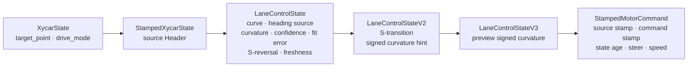

# Engineering Iterations

이 문서는 결과만 나열하지 않고, 실차·replay·simulation에서 드러난 문제를 어떤 계약과 구조 변경으로 연결했는지 기록한다. 정량값은 [실차 보정](REAL_VEHICLE_CALIBRATION.md), [validation manifest](../evaluation/validation_manifest.json), [경기 회고](COMPETITION_RETROSPECTIVE.md)를 근거로 한다.

## 1. Camera sensor-to-control latency

**Problem**

카메라 인지가 실제 장면보다 늦어지면 차선 변화 뒤에 조향이 따라오는 문제가 있었다.

**Symptom**

추론 처리량보다 입력이 빠른 구간에서 오래된 frame을 순서대로 처리하면 perception→control state가 현재 차량 위치를 반영하지 못한다.

**Root Cause / Hypothesis**

문제의 핵심을 FPS 숫자 하나보다 FIFO backlog와 timestamp가 없는 command 계약으로 보았다.

**Measurement**

현재 저장소에는 동일 조건의 before/after latency 원시 로그가 없다. 따라서 mean/median/p95/max 또는 개선율은 산출할 수 없다. 코드에서 확인되는 final safety threshold는 lane state **0.30 s**다.

**Engineering Change**

`frame_router.py`와 `yolo_node.py`를 latest-frame slot + worker event 구조로 구성했다. worker가 바쁠 때 새 프레임이 오면 대기 중인 frame을 교체해 오래된 queue를 비우는 데 시간을 쓰지 않는다. `LaneControlState`와 `StampedMotorCommand`가 원본 perception header, command stamp, state age를 전달한다.

**Validation**

`Integrated_Stanley_Controller`는 source age가 0.30 s를 넘으면 speed 0을 생성하고, Mission Manager가 stamped source/command freshness를 다시 검사한다. `MotorCommandAdapter`에도 0.30 s watchdog이 있다.

**Result**

정량 latency 개선율이 아니라, **backlog accumulation 방지 + 0.30 s stale-state stop**이라는 검증 가능한 안전 성질을 확보했다.

**Limitation / Lesson Learned**

향후 같은 rosbag과 동일 하드웨어 조건에서 FIFO/latest-frame A/B를 실행해 sensor-to-command mean, median, p95, max와 frame replacement 수를 함께 기록해야 한다.

## 2. Single YOLO에서 Dual YOLO로 분리

**Problem**

초기 단일 모델은 차선과 scene class를 같은 해상도·주기로 처리해야 했다.

**Symptom**

작은 lane input으로는 신호/장애물 class 분리가 불리하고, 큰 input으로 모든 class를 처리하면 steering update cadence가 낮아진다.

**Root Cause / Hypothesis**

lane control의 latency 목표와 scene perception의 공간 해상도 목표가 서로 다르므로 하나의 pipeline budget으로 묶는 것이 병목이었다.

**Measurement**

공개 Git history와 evaluation에는 single-model 시절의 동등 조건 FPS가 없다. 개선 percentage는 쓰지 않는다.

**Engineering Change**

`frame_router.py`가 camera stream을 둘로 나눈다.

| Branch | Model role | Input | Competition ceiling |
|---|---|---:|---:|
| Lane | `center_line` only | imgsz 320 | 최대 15 Hz |
| Scene | cone/dynamic/green/left/red/static | imgsz 640 | 최대 10 Hz |

두 YOLO worker는 독립이며 scene cache가 lane synchronizer를 막지 않는다.

**Validation**

`scripts/start_integrated_drive_container.sh`에서 320/15와 640/10을 확인했고, [인지 증거](VALIDATION_EVIDENCE.md)는 두 최종 checkpoint를 같은 실차 frame에 재실행한다.

**Result**

차선 반응성과 scene class 해상도를 서로 다른 budget으로 운용할 수 있는 구조가 됐다. 이는 목표 rate의 분리이지 측정되지 않은 FPS 개선 주장과 다르다.

**Limitation / Lesson Learned**

node default는 replay 호환을 위해 lane 12 Hz, scene 4 Hz가 남아 있다. 최종 운용값을 설명할 때 launcher와 node default를 반드시 구분한다.

## 3. Perception → Control interface evolution

**Problem**

`target_point + drive_mode`만으로는 곡선, heading 신뢰도, S자 반전, 입력 freshness에 따라 제어 전략을 바꾸기 어렵다.

**Symptom**

같은 target point라도 straight/curve, Hough/fitted heading, 낮은 path confidence에서 필요한 gain과 speed policy가 달랐다.

**Root Cause / Hypothesis**

Perception이 이미 계산한 geometry/quality 정보를 좁은 interface에서 버리고 있었다.

**Measurement**

`custom_interfaces/msg`와 controller subscription을 직접 대조했다.

**Engineering Change**

| Message | 추가된 계약 |
|---|---|
| `XycarState` | BEV target point와 drive mode |
| `StampedXycarState` | source perception timestamp |
| `LaneControlState` | curve state, heading source/validity, curvature/severity, preview ratio, fit error, path confidence, S-reversal |
| `LaneControlStateV2` | S-transition과 signed curvature hint |
| `LaneControlStateV3` | preview signed curvature hint |
| `StampedMotorCommand` | source header 보존, command time, state age, angle, speed |

기존 bag과 tool을 깨지 않도록 V2/V3를 nested backward-compatible extension으로 추가했다.

**Validation**

`Lane_Detector.py`가 모든 버전을 발행하고 final launch의 Stanley node는 V3→V2→base state fallback을 구독한다. stamped motor command는 Mission Manager의 source freshness 검사에 사용된다.

**Result**

제어기가 geometry뿐 아니라 confidence와 시간 품질에 따라 gain/speed/safety 결정을 내릴 수 있게 됐다.

**Limitation / Lesson Learned**

버전이 늘면 topic 계약이 복잡해진다. 향후 안정화 시 message migration과 bag 변환 계획이 필요하다.

## 4. Fixed Stanley gain에서 gain scheduling으로

**Problem**

고정 cross-track gain은 직선 고속의 noise와 급곡선 correction을 동시에 만족시키기 어렵다.

**Symptom**

큰 k는 고속 직선에서 작은 CTE 변화에도 과조향을 만들 수 있고, 작은 k는 곡선이나 급격한 목표 lane 변경에서 lateral correction이 부족하다.

**Root Cause / Hypothesis**

속도와 path context가 달라지는데 동일한 correction gain과 heading weight를 적용한 것이 문제였다.

**Measurement**

현재 public history는 기존 개발 이력을 한 commit으로 import해 fixed-gain 시점의 비교 로그는 남아 있지 않다. 다음은 current final script에서 직접 읽은 값이다.

| Context | Low-speed k | High-speed k | Schedule range |
|---|---:|---:|---:|
| Straight | 1.00 | 0.65 | command 4→12 |
| Curve | 1.20 | 0.90 | command 4→12 |
| Obstacle override | **1.80 shared** | **1.80 shared** | event override |

Heading weight도 low speed 0.30에서 straight 0.18, Hough 0.14, curve 0.30으로 scheduling되고 rise/fall smoothing alpha는 0.65/0.35다.

**Engineering Change**

`Integrated_Stanley_Controller.py`가 speed 4–12 사이에서 straight/curve gain을 선형 보간한다. obstacle event에서는 dynamic/static 모두 별도 k를 갖지 않고 **공유 obstacle k=1.80**을 사용한다.

Dynamic/static 차이는 gain이 아니라 final script의 mission parameter에 있다.

| Parameter | Dynamic | Static |
|---|---:|---:|
| Speed cap | 26 | 18 |
| Speed trigger distance | 4.0 m | 3.0 m |
| Overtake trigger distance | 4.0 m | 1.5 m |
| Lane determination distance | 4.0 m | 1.5 m |
| Event duration | 2.0 s | 1.2 s |

**Validation**

Unit tests cover Stanley event trigger, stamped control and obstacle lane-event logic. Before/after tracking-error data는 없다.

**Result**

고속 straight에서는 noise sensitivity를 낮추고, curve와 obstacle override에서는 더 강한 lateral correction을 줄 수 있는 context-aware configuration을 만들었다.

**Limitation / Lesson Learned**

“tracking error N% 개선”은 before/after trajectory log가 없어 쓰지 않는다. 다음 검증은 동일 rosbag과 실차 반복 주행에서 CTE proxy뿐 아니라 vehicle pose 기준 횡오차를 기록해야 한다.

## 5. S-curve speed policy

**Problem**

기존 정책은 강한 S-curve를 빠져나오는 동안 straight 조건이 충분히 확인되기 전에 command 10→16으로 직접 가속할 수 있었다.

**Symptom**

두 replay에서 위험한 직접 가속이 각각 7회와 3회 발생했다.

**Root Cause / Hypothesis**

S reversal 이후 curve-exit 상태를 충분히 hold하지 않아 순간적인 heading/curvature 완화를 straight로 판단했다.

**Measurement**

| Run | Samples | Duration | CTE abs p95 | Heading abs p95 | Command-target MAE | Unsafe 10→16 |
|---|---:|---:|---:|---:|---:|---:|
| 02 | 589 | 39.460 s | 307.923 px | 48.598° | 0.044699 | 7 |
| 03 | 492 | 32.768 s | 276.749 px | 57.933° | 0.028389 | 3 |

**Engineering Change**

10/12/16의 3단 target과 curve-exit 0.5 s hold를 적용했다.

**Validation**

`evaluation/s_curve/*_ab.csv`, summary JSON과 `validation_manifest.json`을 사용했다. CTE는 image-plane proxy이며 실제 차량 pose error가 아니다.

**Result**

Run 02는 **7→0**, Run 03은 **3→0**으로 두 replay 모두에서 해당 위험 이벤트를 **100% 제거**했다.

**Limitation / Lesson Learned**

replay는 command policy regression을 증명하지만 wheel speed나 trajectory response를 증명하지 않는다.

## 6. 경기장의 unseen red source

**Problem**

연습 때 없던 방송 촬영 카메라의 큰 red indicator가 경기장에 추가됐다.

**Symptom**

scene perception이 이를 신호등 red로 오인해 차량이 약 45 s STOP 상태에 머문 것으로 회고됐다.

**Root Cause / Hypothesis**

대회 당시 약 0.20의 낮은 confidence, context-free semantic detection, confirmed red를 길게 유지하는 safety latch가 함께 작용했다.

**Measurement**

공식 결과는 144.65 s + 5.00 s = **149.65 s**다. 약 45 s는 동기화 log가 아닌 manual review이므로 `45 / 149.65 = 30.1%`는 참고 derived value로만 다룬다.

**Engineering Change**

현재 final script는 red threshold 0.30과 2-frame latch confirmation을 사용한다. 외부 red source를 물리적으로 가린 것은 현장 대응이지 software fix가 아니다.

**Validation**

현재 public Git history는 대회 당시 0.20 commit을 독립적으로 보존하지 않아 사용자 회고와 current defaults를 구분해 기록했다.

**Result**

실패를 숨기지 않고 false-positive 비용과 fail-safe recovery의 필요성을 설계 요구사항으로 만들었다.

**Limitation / Lesson Learned**

ROI/location gating, N-of-M confirmation, expected geometry와 distractor regression dataset을 추가해야 한다. 자세한 내용은 [경기 회고](COMPETITION_RETROSPECTIVE.md)에 있다.

## 7. Sim-to-Real framework와 한계

**Problem**

공용 실차 한 대를 튜닝하는 동안 다른 팀원도 control/perception을 개발해야 했지만 CAD, steering geometry, motor map이 없었다.

**Symptom**

단일 steering scale로는 같은 magnitude의 좌우 회전반경을 재현할 수 없었고, 초기 Gazebo는 camera pose·latency·tire dynamics가 실차와 달랐다.

**Root Cause / Hypothesis**

받아서 사용하는 차량의 미측정 geometry/dynamics와 좌우 steering asymmetry가 주된 model uncertainty였다.

**Measurement**

wheelbase 0.355 m, track 0.250/0.266 m, mass 4.1 kg, speed 5 m table와 steering circle을 직접 측정했다. 최대 조향 반경은 right 0.5525 m, left 0.8200 m로 **48.4% 차이**다.

**Engineering Change**

실측 geometry, direction-specific raw↔curvature LUT와 command↔m/s LUT를 simulation adapter에 반영하고 real/sim sensor topic contract를 맞췄다.

**Validation**

Gazebo에서 64 s 이상 연속 주행과 우회전을 통과했다. 최대 조향 circle test의 반경 오차는 right 0.9%, left 1.9%였으나, command 15의 5 m 시간은 real 3.310 s vs sim 3.999 s로 20.8% 차이였다. 급한 S자 후반 좌회전에서는 lane loss 후 safety stop했다.

**Result**

vehicle interface와 geometry calibration까지 가능한 실측 기반 framework를 만들었지만 완전한 digital twin은 아니다.

**Limitation / Lesson Learned**

CAD/steering mechanism, sensor mount 6-DoF, tire friction/slip, steering·motor delay, camera/inference/command latency와 조명 domain gap이 남아 있다. raw ±20/±30의 Gazebo 결과와 동일 조건 trajectory 비교가 없어 전체 sim-real trajectory error는 산출할 수 없다.
