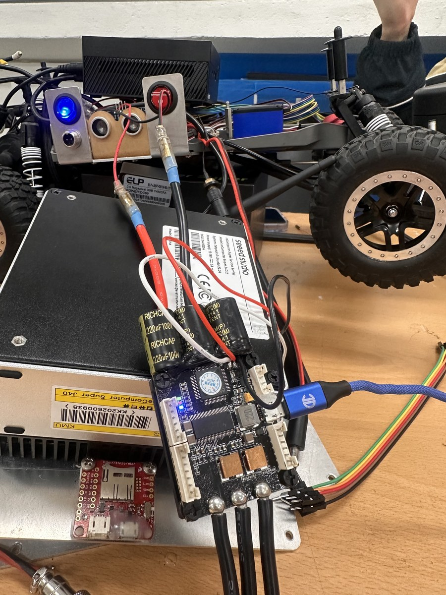
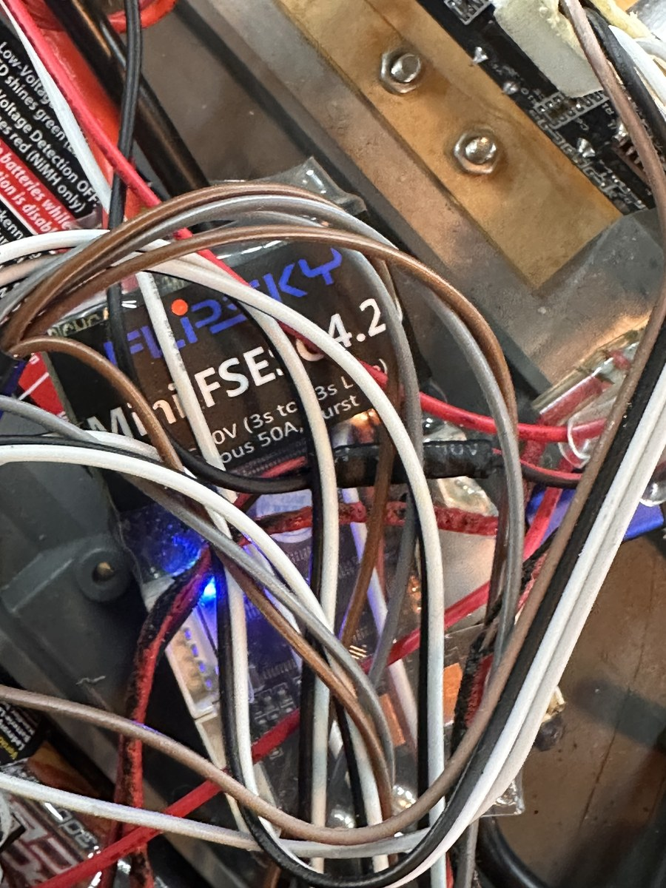
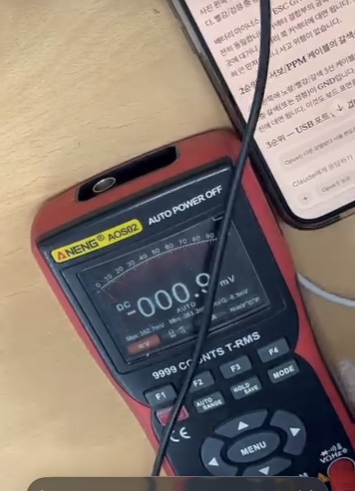
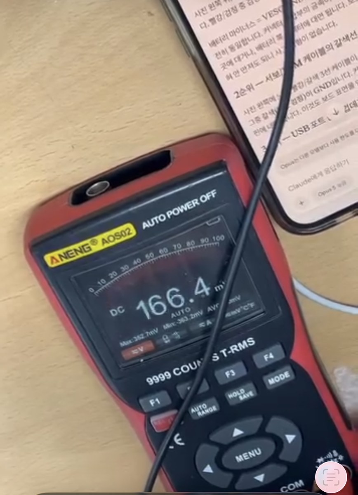

# 실차 측정과 calibration

이 문서는 사용자가 제공한 실차 측정값(C), 저장소 코드·설정에서 직접 확인한 값(A), 그리고 그 입력으로 계산한 값(D)을 분리한다. 원시 표는 [`evaluation/calibration/`](../evaluation/calibration/)에 있고 `python3 tools/render_calibration_evidence.py`로 derived metric과 그래프를 다시 만들 수 있다.

## Evidence class

| Class | 의미 | 이 문서의 예 |
|---|---|---|
| A | 코드/설정에서 직접 확인 | final launch parameter, steering sign mapping |
| B | 저장소 validation/evaluation 데이터 | S-curve replay |
| C | 실차 직접 측정 또는 사용자가 제공한 측정 기록 | 치수, 5 m 시간, 원주행 반경 |
| D | A-C 입력의 수학적 계산 | m/s, 좌우 비대칭률, sim-real error |
| E | 검증 데이터 없음 | 전체 궤적 오차, latency 개선율 |

## 차량 실측 치수

| 항목 | 실측값(C) |
|---|---:|
| Wheelbase | 0.355 m |
| Rear track | 0.266 m |
| Front track | 0.250 m |
| Rear / front / effective wheel radius | 0.050 m |
| Wheel thickness | 0.045 m |
| Rear axle → rear end | 0.140 m |
| Front axle → front end | 0.125 m |
| Vehicle length | 0.620 m |
| Vehicle height | 0.187 m |
| Total mass | 4.1 kg |

이 값은 `simulation/xycar_gz_sim/config/model.yaml`과 Xacro 기본값에 반영돼 있다. 차량 전체 폭 0.320 m, camera/LiDAR mount pose, tire friction과 축중은 저장소에서도 **추정 또는 미측정**으로 표시되어 있다.

## Steering calibration과 좌우 비대칭

직진점은 Ubuntu에서 확인한 physical raw 약 `+7`이다. 실차 관찰상 raw 20에서 앞바퀴 약 20°, raw 40에서 약 30°이자 최대 조향 근처였다. 각도는 육안 측정이므로 반경 LUT의 정밀도와 같은 수준으로 취급하지 않는다.

저속 원주행의 지름을 2로 나눠 rear-axle center 기준 반경을 계산했다.

| Physical raw | 코드상 방향(A) | 실차 지름(C) | 실차 반경(D) |
|---:|---|---:|---:|
| +20 | right | 2.300 m | 1.1500 m |
| +30 | right | 1.560 m | 0.7800 m |
| +40 | right | 1.105 m | 0.5525 m |
| -20 | left | 4.830 m | 2.4150 m |
| -30 | left | 2.630 m | 1.3150 m |
| -40 | left | 1.640 m | 0.8200 m |

`simulation/xycar_gz_sim/config/xycar.yaml`은 physical raw `+`를 right, `-`를 left로 명시한다. 다만 bag 호환 `/xycar_motor` 경계에는 `motor_topic_steer_sign=-1.0`이 있어 physical raw +7 직진이 topic에서는 -7로 기록된다. physical calibration 부호와 ROS topic 부호를 섞지 않아야 한다.

| \|raw\| | Right radius | Left radius | Left / right | Left radius가 더 큰 비율(D) |
|---:|---:|---:|---:|---:|
| 20 | 1.150 m | 2.415 m | 2.100× | 110.0% |
| 30 | 0.780 m | 1.315 m | 1.686× | 68.6% |
| 40 | 0.5525 m | 0.820 m | 1.484× | 48.4% |

같은 command magnitude에서도 curvature가 크게 다르므로 단일 steering scale 대신 방향별 raw↔curvature LUT를 사용한다. 이 값은 **실차 좌우 steering asymmetry**이며 Gazebo 오차가 아니다.

## 5 m speed calibration

계산식은 `v = 5 m / elapsed time`이다.

| Command | 5 m time(C) | Derived speed(D) |
|---:|---:|---:|
| 4 | 12.54 s | 0.399 m/s |
| 5 | 9.84 s | 0.508 m/s |
| 6 | 8.27 s | 0.605 m/s |
| 7 | 7.20 s | 0.694 m/s |
| 8 | 6.57 s | 0.761 m/s |
| 9 | 5.07 s | 0.986 m/s |
| 10 | 4.90 s | 1.020 m/s |
| 12 | 4.01 s | 1.247 m/s |
| 15 | 3.31 s | 1.511 m/s |
| 20 | 2.58 s | 1.938 m/s |
| 25 | 2.25 s | 2.222 m/s |

Command 4→25에서 5 m 시간은 12.54→2.25 s로 **82.1% 감소**했고, derived speed는 0.399→2.222 m/s로 **5.57배**가 됐다. 이 response는 전 범위에서 완전히 선형이지 않다. 따라서 측정점 사이에서는 piecewise-linear LUT를 쓰고, 범위 밖을 실제값처럼 외삽하지 않는다.

## 제한적으로 확인된 sim-real 수치

저장소의 Gazebo 검증 결과는 ±40과 speed 15만 기록돼 있다. 아래 error는 `|sim-real| / real × 100`으로 다시 계산했다.

| Test | Real(C) | Gazebo(B) | Absolute error(D) |
|---|---:|---:|---:|
| raw +40 right radius | 0.5525 m | 0.5474 m | 0.0051 m, 0.9% |
| raw -40 left radius | 0.8200 m | 0.8042 m | 0.0158 m, 1.9% |
| command 15, 5 m time | 3.310 s | 3.999 s | 0.689 s, 20.8% |

첫 두 결과는 LUT로 의도한 최대 조향 반경을 Gazebo가 재현하는지 확인한 값이다. trajectory-level sim-to-real 정확도를 의미하지 않는다. speed 15의 시간 차이는 미측정 acceleration/deceleration 파라미터가 아직 맞지 않음을 보여 준다. raw ±20/±30의 Gazebo 측정 결과는 현재 저장소에 없으므로 해당 sim-real error를 산출하지 않았다.

## Measurement media와 누락 자료

| Electronics setup | VESC/fuse wiring | 0 mV capture | 166.4 mV capture |
|:---:|:---:|:---:|:---:|
|  |  |  |  |

5 m command 5/10/15 rosbag 원본은 공개 저장소와 제공된 작업공간에서 찾지 못했다. 따라서 이 문서의 속도 표는 사용자 제공 시간 기록을 source of truth로 삼고, telemetry response나 wheel-speed transient는 주장하지 않는다.
