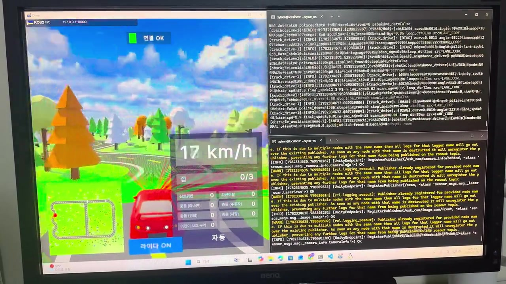
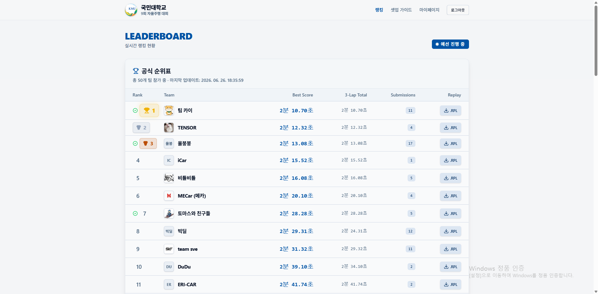
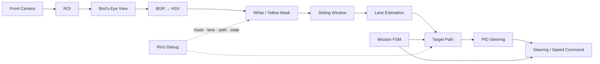
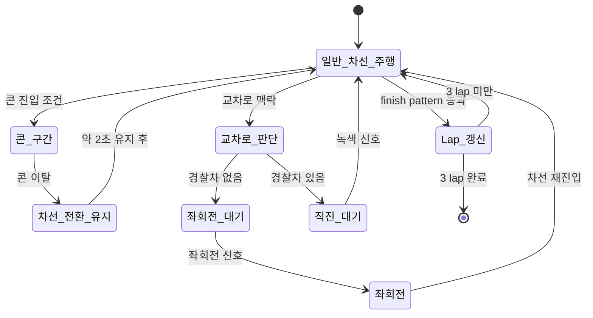

# Qualifying Round — Official Simulator

국민대학교 제9회 자율주행 경진대회 예선에서 Team SVE가 공식 simulator로 3-lap 자율주행을 완성한 과정을 정리했다. 본선 실차 stack과 섞이지 않도록 예선의 문제 정의, architecture, 제어 변화, mission 설계, 영상과 결과 근거만 이 디렉터리에 모았다.

> **최종 결과: 132팀 중 9위 · 3-lap 2분 31.32초(151.32초)**

## Overview

| 항목 | 내용 | 근거 범위 |
|---|---|---|
| Competition | 제9회 국민대학교 자율주행 경진대회 Qualifying Round | 공식 대회 사이트 |
| Organizer | Xytron | 공식 대회 사이트 |
| Team | Team SVE, 5명 | 사용자 제공 |
| Project development | 2026.05.18–2026.06.26 | 사용자 제공 |
| Official schedule | 예선 설명회 2026.05.23, 연장 제출 마감 2026.06.26 | [공식 일정](https://auto-contest.kookmin.ac.kr/%ED%99%88) |
| Platform | 국민대학교 공식 simulator | 사용자 제공·주행 영상 |
| Result | 3-lap 2:31.32, 132팀 중 9위, 11 submissions | 사용자 제공·leaderboard 캡처 |

공식 사이트에 표시된 예선 설명회와 제출 마감은 프로젝트 내부 개발 시작일과 다른 개념이다. 따라서 프로젝트 기간과 공식 운영 일정을 분리해 적었다. leaderboard 캡처의 당시 화면에는 50개 팀이 표시되며 Team SVE의 9위, 2분 31.32초, 11회 제출을 확인할 수 있다. 전체 참가 규모 132팀은 사용자 제공 최종 정보다.

## Evidence

<p align="center">
  <a href="media/qualifying_run.mp4">
    
  </a>
</p>

<p align="center"><strong><a href="media/qualifying_run.mp4">▶ 예선 simulator 전체 주행 영상 재생</a></strong></p>



- 영상은 사용자가 제공한 팀 보유 원본 전체를 H.264/720p로 변환한 정성 자료다. 원본 녹화에는 시작 대기와 화면 촬영 맥락이 포함되어 있어 파일 길이를 공식 3-lap 기록으로 해석하지 않았다.
- leaderboard는 2026.06.26 18:35:59에 마지막 갱신된 화면이다. 9위, best score 2분 31.32초, 3-lap total 2분 29.32초, submissions 11이 표시되어 있다. 이 문서의 공식 제출 성적 표기는 사용자 요청에 따라 best score인 2분 31.32초를 사용했다.
- 전체 참가 규모 132팀은 캡처 한 장으로 독립 검증할 수 없으므로 사용자 제공 결과로 구분했다.

파일 규격과 checksum은 [media/README.md](media/README.md)에 기록했다. 수치 계산은 [evaluation/README.md](evaluation/README.md)에서 확인할 수 있다.

## My Contribution

| 담당 영역 | 수행 내용 |
|---|---|
| Rule-based FSM | 미션 조건과 전환 순서를 설계하고 3-lap 전체 흐름을 통합했다. |
| PID lane control | 차선 중심 오차 기반 조향을 구현하고 gain·속도 정책을 튜닝했다. |
| Lane perception | ROI, BEV, HSV mask, sliding window를 연결하고 흰색·노란색 차선을 안정화했다. |
| Lane path generation | 검출된 차선 조합의 우선순위를 정하고 controller 입력 path를 생성했다. |
| Mission integration | 콘, 신호등, 경찰차 맥락, 좌회전, lap counting과 finish 판정을 연결했다. |
| RViz debugging | mask, 차선 점, 목표 path와 상태 전환을 시각화해 오인식과 불안정 구간을 추적했다. |
| Tuning & validation | 초기 276.00초에서 최종 151.32초까지 perception·planning·control pipeline을 반복 개선했다. |

팀 프로젝트이므로 모든 구현을 혼자 했다는 의미가 아니다. 직접 담당·주도한 영역과 팀 통합 작업을 사용자 제공 개발 기록을 기준으로 정리했다.

## System Architecture



예선 stack은 classical vision과 rule-based decision으로 구성했다. simulator 환경의 색과 geometry를 이용하되 단일 frame 검출 결과만으로 곧바로 미션을 바꾸지 않고 상태와 전환 조건을 함께 관리했다.

### Mission Flow

아래 흐름은 원본 source가 아닌 사용자 제공 개발 기록을 바탕으로 복원한 개념도다. 당시 상수명이나 state identifier처럼 보이도록 임의의 코드 이름을 만들지 않았다.



## Lane Perception & Path Generation

```text
Front camera
  → 관심영역(ROI) 제한
  → Bird's-Eye View 변환
  → BGR에서 HSV로 변환
  → 흰색/노란색 mask 생성
  → sliding-window 기반 차선 점 추적
  → 차선 곡선과 주행 path 생성
  → PID 횡방향 제어
```

노란색 차선을 우선 기준으로 사용하고, 흰색 차선도 함께 안정적으로 검출되면 두 차선의 중점을 주행 path로 사용했다. 한쪽 차선만 보이는 구간에서는 남은 차선과 차선 폭 가정을 이용해 목표 중심을 유지했다. RViz에는 색상 mask, 추적 point, lane curve, 목표 path와 mission 상태를 표시해 perception 오류와 controller 오류를 분리했다.

## Controller Evolution: Pure Pursuit → PID

초기에는 path point를 따라가는 Pure Pursuit를 시험했다. 그러나 simulator의 직선 구간에서 작은 path 변동이 steering correction을 반복 유발해 좌우 진동이 커졌다. 예선 최종안은 화면상 차선 중심 오차를 직접 다루는 PID로 전환했다.

| Stage | 관찰 | 변경 |
|---|---|---|
| Early Pure Pursuit | 직선에서 목표점 변동과 steering correction이 반복되었다. | look-ahead와 path 생성 방식을 조정했다. |
| PID transition | center error를 직접 안정화할 필요가 있었다. | 최종 lane controller를 PID로 전환했다. |
| Speed policy | 직선 진입 직후의 오판정이 고속 흔들림으로 이어졌다. | 직선 frame이 10회 연속 확인된 뒤 고속 주행하도록 했다. |

이 변화만으로 45.2% 개선이 만들어졌다고 주장하지 않았다. 기록 단축은 perception mask, path 안정화, FSM transition, 좌회전 recovery, lap/finish 판정과 속도 정책을 함께 개선한 결과였다.

## Mission Engineering

### 1. Cone → Lane Transition

콘 미션이 끝난 직후 차선 검출이 순간적으로 불안정해질 수 있었다. 콘 이탈 판단 뒤 약 2초 동안 전환 상태를 유지한 후 일반 차선 주행으로 넘겼다. 이 값은 사용자 제공 개발 설정이며 원본 코드 상수로 재검증할 수는 없다.

### 2. Police Car & Traffic-Light Ordering

신호 class 하나만 보는 방식 대신 교차로 맥락과 경찰차 존재 여부를 먼저 판단했다.

- 경찰차가 없으면 좌회전 신호를 기다린 뒤 좌회전했다.
- 경찰차가 있으면 녹색 신호를 기다린 뒤 직진했다.
- 경찰차·신호·차선 상태의 판단 순서를 고정해 동시에 보이는 객체 때문에 잘못된 branch로 들어가는 것을 줄였다.

### 3. Left-Turn Recovery

좌회전은 경찰차, red/green/left signal, stop line과 shortcut 맥락을 묶어 판단했다. 회전 중 path를 놓치거나 자세가 틀어지면 약 2초 후진해 관측 위치를 회복한 뒤 좌회전을 다시 시도했다. 이 시간도 사용자 제공 개발 설정이며 임의의 threshold나 state constant는 추가하지 않았다.

### 4. Lap Counting & Finish

코스의 검정/흰색 finish-line pattern을 이용해 lap을 갱신했다. 같은 pattern을 여러 frame에서 반복 인식해 중복 count하는 문제와, 3-lap 종료 전에 stop하는 문제를 상태 기반으로 막았다. 최종 lap이 확인되면 주행 command를 종료했다.

## Evaluation

| Metric | Initial | Final | Improvement |
|---|---:|---:|---:|
| 3-lap elapsed time | 276.00 s | **151.32 s** | **124.68 s 감소, 45.17% 개선** |
| Rank | — | **132팀 중 9위** | 사용자 제공 최종 결과 |
| Submissions | — | **11회** | leaderboard 캡처 |

계산식은 `(276.00 - 151.32) / 276.00 × 100 = 45.1739…%`이며 소수 둘째 자리에서 반올림해 45.17%로 표시했다. 평가 입력과 근거 범위는 [evaluation 자료](evaluation/README.md)에 남겼다.

## From Qualifying to Main Round

예선 PID는 simulator의 일정한 camera geometry와 lane color에서 빠르게 안정화하기에 적합했다. 실차 본선에서는 fisheye 왜곡, 조명 변화, lane loss, 차량 동역학과 속도 변화가 더 컸다. 따라서 lane control은 횡오차와 heading error를 함께 사용하는 scheduled Stanley로 확장했다. 반면 콘 구간은 LiDAR로 만든 waypoint/spline path를 따라야 했기 때문에 Pure Pursuit를 다시 선택했다.

예선에서 만든 “인지 → path → controller → mission transition → debug” 사고방식은 본선의 Dual YOLO, OpenCV lane geometry, LiDAR fusion, Mission Manager, stamped freshness와 VESC watchdog 구조로 이어졌다. [본선 포트폴리오](../docs/MAIN_ROUND.md)에서 연결 과정을 확인할 수 있다.

## Source Availability

예선 원본 source와 simulator replay 파일은 현재 공개 Git history에 남아 있지 않다. commit 전체를 확인했지만 원본 FSM, lap counter, 경찰차/신호 분기와 예선 controller를 복원할 수 있는 파일은 찾지 못했다. 따라서 검증되지 않은 code를 새로 작성하거나 `src/` 디렉터리를 만들어 원본처럼 제시하지 않았다.

[`simulation/team_code/track_drive/track_drive/lane_drive.py`](../simulation/team_code/track_drive/track_drive/lane_drive.py)는 예선의 BEV, white/yellow mask, sliding-window와 PID 아이디어 일부를 본선 Sim-to-Real 과정에서 정리한 후속 adapter다. 예선 제출 당시의 원본 source는 아니다. 이 문서에서 구체적 동작을 설명한 부분은 사용자 제공 개발 기록, leaderboard 캡처와 주행 영상에 근거했다.
